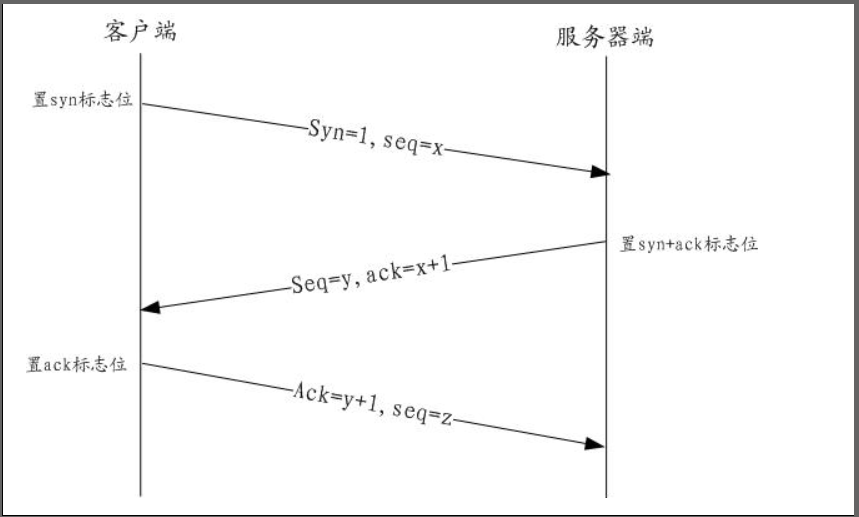

# 0.tips

## 0.1 交叉编译

Mac 下编译， Linux 或者 Windows 下去执行

```sh
# linux 下去执行
CGO_ENABLED=0  GOOS=linux  GOARCH=amd64  go build main.go
# Windows 下去执行
CGO_ENABLED=0 GOOS=windows  GOARCH=amd64  go  build  main.go
```

Linux 下编译 ， Mac 或者 Windows 下去执行

```sh
# Mac  下去执行
CGO_ENABLED=0 GOOS=darwin  GOARCH=amd64  go build main.go
# Windows 下执行
CGO_ENABLED=0 GOOS=windows  GOARCH=amd64  go build main.go
```

 Windows 下执行 ， Mac 或  Linux 下去执行

需要写一个批处理程序，在里面去设置，因为windows 下的 terminal 不支持shell , 这跟 Mac 和 Linux下的有点不同

```sh
# Mac 下执行
SET  CGO_ENABLED=0
SET GOOS=darwin
SET GOARCH=amd64
go build main.go

# Linux 去执行
SET CGO_ENABLED=0
SET GOOS=linux
SET GOARCH=amd64
go build main.go
```


# 1.网络基础

## 1.1 TCP 三次握手



* 客户端发送SYN=1,SEQ=number(随机数字)报文给服务器端,客户端进入SYN_SEND状态

* 服务器收到SYN报文,SYN=1知道客户端要建立连接,响应ACK NUMBER(客户端SEQ+1),SYN=1,ACK=1,SEQ=随机数字,连接状态SYN_RECV状态

* 客户端收到SYN,检查ACK NUMBER和ACK=1是否正确,如果全部正确,向服务器端发送ACK NUMBER=服务端SEQ+1和ACK=1.服务器接收到后检查是否正确,正确后建立连接.连接状态进入ESTABLISHED

  

TCP关闭连接需要四次握手,包含一次角色转换.(以客户端主动发起关闭请求举例)


* 主机A(主动方, Active Close)向主机B(被动方)发送FIN表示数据发送完成ACK=z,SEQ=x.主机A进入FIN_WAIT1状态,这个状态非常短暂.之后等待对方确认ACK过程自己进入FIN_WAIT2状态.如果超时没有收到ACK直接进入CLOSED状态
* 主机B收到FIN后返回主机A内容ACK=x+1,SEQ=z,主机B进入CLose_wait状态
* 主机B关闭连接发送给主机A内容ACK=x,SEQ=y.主机A进入到TIME_WAIT状态,处于这个状态后等待2个报文最大存活周期后进入CLOSED状态.此时主机B进入LAST_ACK状态
* 主机A收到后返回ACK=y+1,SEQ=x

## 1.2 UDP

* User Datagram Protocol 用户数据报协议
* 是一种无连接的协议
* 基于UDP协议主机把数据包发送给网络后就不管了,是一种不可靠协议

## 1.3 TCP和UDP的主要区别

* TCP是安全可靠的,UDP是不安全,不可靠的
* UDP的速度要高于TCP

## 1.4 响应状态码

状态码用来告诉HTTP客户端，HTTP服务器是否产生了预期的Response。HTTP/1.1协议中定义了5类状态码，状态码由三位数字组成，第一个数字定义了响应的类别

| code             | tips                             |
| ---------------- | -------------------------------- |
| 1xx 提示信息     | 表示请求已被成功接收，继续处理   |
| 2xx 成功         | 表示请求已被成功接收，理解，接收 |
| 3xx 重定向       | 要完成请求必须进行更进一步的处理 |
| 4xx 客户端错误   | 请求语法错误或请求无法实现       |
| 5xx 服务器端错误 | 服务器未能实现合法的请求         |

常见的状态码

| code | tips                                                         |
| ---- | ------------------------------------------------------------ |
| 200  | 请求成功，浏览器会把响应体内容（通常是html）显示在浏览器中   |
| 404  | 请求的资源没有找到，说明客户端错误的请求类不存在的资源       |
| 500  | 请求资源找到了，但服务器内部出现了错误                       |
| 302  | 重定向，当响应码为302时，表示服务器要求浏览器重新再发一个请求，服务器会发送一个响应头Location,它指定了新请求的URL地址 |
|      |                                                              |


# 2.sql

## 2.1 mysql

### 2.1.1 docker 配置mysql环境

#### 2.1.1.1 mysql5.7

```shell
docker pull mysql:5.7
mkdir -p $HOME/data/mysql/1/conf && mkdir -p $HOME/data/mysql/1/data && mkdir -p $HOME/data/mysql/1/logs
vim $HOME/data/mysql/1/conf/mysqld.cnf
```

```shell
[mysqld]
pid-file	= /var/run/mysqld/mysqld.pid
socket		= /var/run/mysqld/mysqld.sock
datadir		= /var/lib/mysql
#log-error	= /var/log/mysql/error.log
# By default we only accept connections from localhost
#bind-address	= 127.0.0.1
# Disabling symbolic-links is recommended to prevent assorted security risks
symbolic-links=0
sql_mode = STRICT_TRANS_TABLES,NO_AUTO_CREATE_USER,NO_ENGINE_SUBSTITUTION
default-time-zone='+8:00'
#事务隔离级别，默认为可重复读，mysql默认可重复读级别（此级别下可能参数很多间隙锁，影响性能）
transaction_isolation = READ-COMMITTED
#数据库默认字符集, 主流字符集支持一些特殊表情符号（特殊表情符占用4个字节）
character-set-server = utf8mb4
#数据库字符集对应一些排序等规则，注意要和character-set-server对应
collation-server = utf8mb4_general_ci 
#设置client连接mysql时的字符集,防止乱码
init_connect='SET NAMES utf8mb4'
#是否对sql语句大小写敏感，1表示不敏感
lower_case_table_names = 1
#SQL数据包发送的大小，如果有BLOB对象建议修改成1G
max_allowed_packet = 128M
#MySQL连接闲置超过一定时间后(单位：秒)将会被强行关闭
#MySQL默认的wait_timeout  值为8个小时, interactive_timeout参数需要同时配置才能生效
interactive_timeout = 1800
wait_timeout = 1800
#内部内存临时表的最大值 ，设置成128M。
#比如大数据量的group by ,order by时可能用到临时表，
#超过了这个值将写入磁盘，系统IO压力增大
tmp_table_size = 134217728
max_heap_table_size = 134217728
#order by 或group by 时用到
#建议先调整为2M，后期观察调整
sort_buffer_size = 2097152
#一般数据库中没什么大的事务，设成1~2M，默认32kb
binlog_cache_size = 524288
#TIMESTAMP如果没有显示声明NOT NULL，允许NULL值
explicit_defaults_for_timestamp = true
```

```shell
docker run -p 10001:3306 --name mysql5.7_001 --privileged=true -v $HOME/data/mysql/1/conf/mysqld.cnf:/etc/mysql/mysql.conf.d/mysqld.cnf -v $HOME/data/mysql/1/logs:/var/log/mysql -v $HOME/data/mysql/1/data:/var/lib/mysql -e MYSQL_ROOT_PASSWORD=123456  -d mysql:5.7
```

--privileged=true 获取临时的selinux的权限
-v 宿主机目录挂在到容器的地址，映射
-e MYSQL_ROOT_PASSWORD 初始化密码

#### 2.1.1.2 产生错误

1. 

```mysql
ERROR 2013 (HY000): Lost connection to MySQL server at 'reading initial communication packet', system error: 104 
```

解决办法

```mysql
my.cnf 里面的 [mysqld] 段增加一个启动参数 
skip-name-resolve 
```

副作用

```
skip-name-resolve是禁用dns解析，所以在mysql的授权表中就不能使用主机名了，只能使用IP
```

#### 2.1.1.3 配置主从复制

**master**

```shell
vim $HOME/data/mysql/1/conf/mysqld.cnf
```

```mysql
############################主从复制 设置 ########################################
## 设置server_id，一般设置为IP，同一局域网内注意要唯一
server_id=100  
## 复制过滤：也就是指定哪个数据库不用同步（mysql库一般不同步）
binlog-ignore-db=mysql  
## 开启二进制日志功能，可以随便取，最好有含义（关键就是这里了）
log-bin=edu-mysql-bin  
## 为每个session 分配的内存，在事务过程中用来存储二进制日志的缓存
binlog_cache_size=1M  
## 主从复制的格式（mixed,statement,row，默认格式是statement）
binlog_format=mixed  
## 二进制日志自动删除/过期的天数。默认值为0，表示不自动删除。
expire_logs_days=7  
## 跳过主从复制中遇到的所有错误或指定类型的错误，避免slave端复制中断。
## 如：1062错误是指一些主键重复，1032错误是因为主从数据库数据不一致
slave_skip_errors=1062  
```

```shell
service mysql restart
```

**salve**

```shell
vim $HOME/data/mysql/2/conf/mysqld.cnf
```

```my
############################主从复制 设置 ########################################
## 设置server_id，一般设置为IP,注意要唯一
server_id=101  
## 复制过滤：也就是指定哪个数据库不用同步（mysql库一般不同步）
binlog-ignore-db=mysql  
## 开启二进制日志功能，以备Slave作为其它Slave的Master时使用
log-bin=edu-mysql-slave1-bin  
## 为每个session 分配的内存，在事务过程中用来存储二进制日志的缓存
binlog_cache_size=1M  
## 主从复制的格式（mixed,statement,row，默认格式是statement）
binlog_format=mixed  
## 二进制日志自动删除/过期的天数。默认值为0，表示不自动删除。
expire_logs_days=7  
## 跳过主从复制中遇到的所有错误或指定类型的错误，避免slave端复制中断。
## 如：1062错误是指一些主键重复，1032错误是因为主从数据库数据不一致
slave_skip_errors=1062  
## relay_log配置中继日志
relay_log=edu-mysql-relay-bin  
## log_slave_updates表示slave将复制事件写进自己的二进制日志
log_slave_updates=1  
## 防止改变数据(除了特殊的线程)
read_only=1  
```

 ```shell
service mysql restart
 ```

重启容器

**master链接slave**

进入master mysql,创建同步用户backup

```mysql
show master status;
GRANT REPLICATION SLAVE ON *.* to 'backup'@'%' identified by 'backup';
show grants for 'backup'@'%';
```

记录下File 和 Position字段值

进入slave mysql

```mysql
#change master to master_host='172.17.0.2', master_user='slave', master_password='123456', master_port=3306, master_log_file='edu-mysql-bin.000001', master_log_pos=609, master_connect_retry=30; 
changer master master_host='172.17.0.2'master_port=3306,master_user='backup',master_password='backup';
```

解释

```mysql
master_host: Master 的IP地址
master_user: 在 Master 中授权的用于数据同步的用户
master_password: 同步数据的用户的密码
master_port: Master 的数据库的端口号
master_log_file: 指定 Slave 从哪个日志文件开始复制数据，即上文中提到的 File 字段的值
master_log_pos: 从哪个 Position 开始读，即上文中提到的 Position 字段的值
master_connect_retry: 当重新建立主从连接时，如果连接失败，重试的时间间隔，单位是秒，默认是60秒。
```

在slave mysql 查看主从同步状态

```mysql
show slave status \G;
#SlaveIORunning 和 SlaveSQLRunning 是No，表明 Slave 还没有开始复制过程。相反 SlaveIORunning 和 SlaveSQLRunning 是Yes表明已经开始工作了
```

开启主从同步

```mysql
start slave;
```

#### 2.1.1.4 提升导入速度

```shell
mysql>use test;
Database changed

mysql> set global innodb_flush_log_at_trx_commit=0;
Query OK, 0 rows affected (0.03 sec)

mysql> set global max_allowed_packet=1024*1024*20;
Query OK, 0 rows affected (0.00 sec)

mysql> set global bulk_insert_buffer_size=32*1024*1024;
Query OK, 0 rows affected (0.00 sec)

mysql> set global innodb_buffer_pool_size=32*1024*1024;
Query OK, 0 rows affected, 1 warning (0.09 sec)

>mysql source /root/test.sql
```

导入时使用，不要写进配置文件

### 2.1.2 go链接mysql

导入mysql驱动

```shell
go get github.com/go-sql-driver/mysql
```

新建test1数据库，创建people表

```my
$ create database test1;
$ use test1;
$ create table people (id int primary key auto_increment,name varchar(20),address varchar(100));
```

链接代码

在go 中要求：

- 如果修改前和修改后的值相同，RowsAffected()返回0
- 如果要删除的数据不存在时，RowsAffected()返回0
- 执行查询SQL时，Stmt调用的是Query()方法

```go	
package main

import (
	"database/sql"
	"fmt"

	//此处mysql 驱动需要自行写入
	_ "github.com/go-sql-driver/mysql"
)

func main() {
	/*1.打开数据库连接 */
	db, err := sql.Open("mysql", "root:123456@tcp(127.0.0.1:10001)/test1")
	db.Ping() //真正打开数据库链接
	defer func() {
		if db != nil {
			db.Close()
		}
	}()

	if err != nil {
		fmt.Println("数据库链接失败")
		return
	}

	/*2.预处理SQL */
	/*增删改*/
	/*增删改都一个意思，查询不一样*/
	//? 表示占位符
	stmt, err := db.Prepare("insert into people values(default,?,?)")
	defer func() {
		if stmt != nil {
			stmt.Close()
		}
	}()

	if err != nil {
		fmt.Println("预处理失败")
		return
	}

	//参数和占位符对应
	r, err := stmt.Exec("琪琪", "杭州")
	if err != nil {
		fmt.Println("sql执行失败")
		return
	}

	/*3.获取结果*/
	ccount, err := r.RowsAffected()

	if err != nil {
		fmt.Println("结果获取失败")
		return
	}

	if ccount > 0 {
		fmt.Println("新增成功")
	} else {
		fmt.Println("新增失败")
	}

	/*4.获取新增时主键值*/
	id, err := r.LastInsertId()
	if err != nil {
		fmt.Println("获取键值失败")
	} else {
		fmt.Println("新增键值：", id)
	}

	/* 查 */
	stmt1, err := db.Prepare("select * from people")
	if err != nil {
		fmt.Println("预处理失败")
	}
	defer func() {
		if stmt1 != nil {
			stmt1.Close()
			fmt.Println("stmt1关闭")
		}
	}()

	/*Exec() 参数为不定项参数，对应占位符？个数 */
	rows, err := stmt1.Query()
	if err != nil {
		fmt.Println("查询失败")
	}

	for rows.Next() {
		var id1 int
		var name, address string
		rows.Scan(&id1, &name, &address)
		fmt.Println(id1, name, address)
	}
	defer func() {
		if rows != nil {
			rows.Close()
			fmt.Println("关闭结果集")
		}
	}()
}

```

## 2.2 redis

### 2.2.1 docker 配置redis环境

```shell
mkdir -p $HOME/data/redis/1/conf && mkdir -p $HOME/data/redis/1/data
vim $HOME/data/redis/1/conf/redis.conf
```

```shell
#bind 127.0.0.1
protected-mode no
appendonly yes
requirepass 123456
```

- 将bind 127.0.0.1注释掉，保证可以从远程访问到该Redis，不单单是从本地

- Redis protected-mode 是3.2 之后加入的新特性，Protected-mode 是为了禁止公网访问redis cache，加强redis安全的它启用的条件，有两个：
  1） 没有bind IP
  2） 没有设置访问密码

  如果启用了，则只能够通过lookback ip（127.0.0.1）访问Redis cache

- appendonly：开启数据持久化到磁盘，由于开启了磁盘映射，数据最终将落到`/Users/louxiujun/docker/redis/data`目录下

- requirepass：设置访问密码为123456

```shell
docker run --name redis_latest_001 -p 20001:6379 -v $HOME/data/redis/1/data:/data -v $HOME/data/redis/1/conf/redis.conf:/etc/redis/redis.conf -d redis redis-server /etc/redis/redis.conf
```

### 2.2.2 连接 redis

docker 直连

```shell
docker exec -it redis_latest_001 redis-cli
```

链接远程redis

```shell
redis-cli -h host -p port -a password
```

### 2.2.3 错误

- 有时候会有中文乱码。要在 redis-cli 后面加上 --raw

### 2.2.4 go链接redis

导入redis驱动

```shell
#旧包位置
go get github.com/garyburd/redigo/redis
#新包位置
go get github.com/gomodule/redigo/redis
```

```go
package main

import (
	"fmt"

	"github.com/gomodule/redigo/redis"
)

func main() {
	conn, err := redis.Dial("tcp", "127.0.0.1:20001")
	if err != nil {
		fmt.Println("err = ", err)
	}
	defer conn.Close()
	err = conn.Send("auth", "123456")
	if err != nil {
		fmt.Println("密码错误,err = ", err)
	}

	//基本操作方法
	_, err = conn.Do("set", "a", "1")
	if err != nil {
		fmt.Println("写入失败，err = ", err)
	}

	r, err := redis.Int(conn.Do("get", "a"))
	if err != nil {
		fmt.Println("读取失败，err = ", err)
	} else {
		fmt.Println(r)
	}

}

```

### 2.2.5 redis 连接池

1. 事先初始化一定数量的链接，放入到连接池

2. 当`go`需要操作`Redis`时，直接从`Redis`中取出链接即可
3. 可以节省临时获取`Redis`链接的时间，从而提高效率

```go
package main

import (
	"fmt"

	"github.com/gomodule/redigo/redis"
)

var pool *redis.Pool

func init() {
	pool = &redis.Pool{
		MaxIdle:     8,   //最大空闲链接数
		MaxActive:   0,   //表示和数据库的最大链接数，0表示无限制
		IdleTimeout: 100, //最大空闲时间，链接之后没有放回，链接会自动增长
		Dial: func() (redis.Conn, error) {
			return redis.Dial("tcp", "127.0.0.1:20001")
		},
	}
}

func main() {

	conn := pool.Get() //从连接池中取出连接
	//defer pool.Close() // 关闭连接池，关闭链接池后即不能从连接池中取连接
	defer conn.Close()

	//conn, err := redis.Dial("tcp", "127.0.0.1:20001")
	// if err != nil {
	// 	fmt.Println("err = ", err)
	// }

	/defer conn.Close()
	err := conn.Send("auth", "123456")
	if err != nil {
		fmt.Println("密码错误,err = ", err)
	}

	//基本操作方法
	_, err = conn.Do("set", "a", "1")
	if err != nil {
		fmt.Println("写入失败，err = ", err)
	}

	r, err := redis.Int(conn.Do("get", "a"))
	if err != nil {
		fmt.Println("读取失败，err = ", err)
	} else {
		fmt.Println(r)
	}

}

```


# 3.字符串类

## 3.1string.Trim()看上去相等的字符串，比较起来不相等

**函数声明**

```go
func Trim(s sting,cutset string) string
```

**官方描述**

返回将 s 前后端所有 cutset 包含的 utf-8 码值都去掉的字符串。

**示例代码**

```go
package main

import (
    "fmt"
    "strings"
 _  "test/subpac"
)

func main(){
    fmt.Println("[ !!! Achtung! Achtung! !!! ]:[]:[", strings.Trim(" !!! Achtung! Achtung! !!! ", "") ,"\b]")
    fmt.Println("[ !!! Achtung! Achtung! !!! ]:[ ]:[", strings.Trim(" !!! Achtung! Achtung! !!! ", " ") ,"\b]")
    fmt.Println("[ !!! Achtung! Achtung! !!! ]:[!]:[", strings.Trim(" !!! Achtung! Achtung! !!! ", "!") , "\b]")
    fmt.Println("[ !!! Achtung! Achtung! !!! ]:[! ]:[", strings.Trim(" !!! Achtung! Achtung! !!! ", "! "), "\b]" )
}
```

**输出结果**

```go
[ !!! Achtung! Achtung! !!! ]:[]:[  !!! Achtung! Achtung! !!! ]
[ !!! Achtung! Achtung! !!! ]:[ ]:[ !!! Achtung! Achtung! !!!]
[ !!! Achtung! Achtung! !!! ]:[!]:[  !!! Achtung! Achtung! !!! ]
[ !!! Achtung! Achtung! !!! ]:[! ]:[ Achtung! Achtung]
```

第一行 cutset 为空（不是空格）：因此输出原字符串。
第二行 cutset 为 ” “（空格）：因此串首尾的两个空格字符被删除了。
第三行 cutset 为 “!” ：收尾未匹配到该 cutset，因此输出原字符串。
第四行 cutset 为 “! “：首先匹配到空格，串首尾空格字符被删除，然后匹配到 “!”，继续删除首尾的各三个 “!”，于是得到该结果串。


