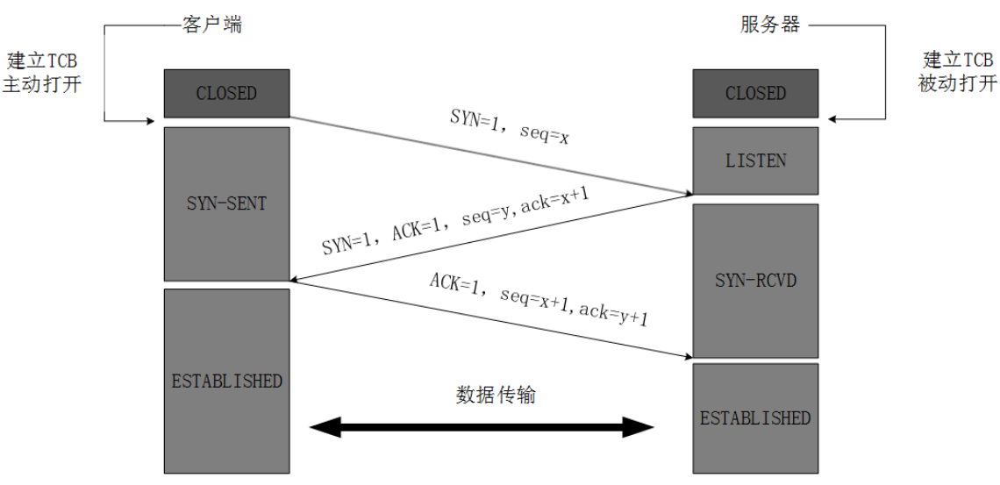

# 0.tips

## 0.1 部署相关

### 0.1.1 交叉编译

Mac 下编译， Linux 或者 Windows 下去执行

```sh
# linux 下去执行
CGO_ENABLED=0  GOOS=linux  GOARCH=amd64  go build main.go
# Windows 下去执行
CGO_ENABLED=0 GOOS=windows  GOARCH=amd64  go  build  main.go
```

Linux 下编译 ， Mac 或者 Windows 下去执行

```sh
# Mac  下去执行
CGO_ENABLED=0 GOOS=darwin  GOARCH=amd64  go build main.go
# Windows 下执行
CGO_ENABLED=0 GOOS=windows  GOARCH=amd64  go build main.go
```

 Windows 下执行 ， Mac 或  Linux 下去执行

需要写一个批处理程序，在里面去设置，因为windows 下的 terminal 不支持shell , 这跟 Mac 和 Linux下的有点不同

```sh
# Mac 下执行
SET  CGO_ENABLED=0
SET GOOS=darwin
SET GOARCH=amd64
go build main.go

# Linux 去执行
SET CGO_ENABLED=0
SET GOOS=linux
SET GOARCH=amd64
go build main.go
```

### 0.1.2 缩减编译后大小

编译后的二进制文件太大，可以在编译的时候加上`-ldflags "-s -w"`参数去掉符号表和调试信息，一般能减小20%的大小

### 0.1.3 普通的命令行进程变为后台守护进程

`Supervisor` 是业界流行的一个通用的进程管理程序，它能将一个普通的命令行进程变为后台守护进程，并监控该进程的运行状态，当该进程异常退出时能将其自动重启。

```bash
sudo yum install supervisor
```

Supervisor 的配置文件为：`/etc/supervisord.conf` ，Supervisor 所管理的应用的配置文件放在 `/etc/supervisord.d/` 目录中，这个目录可以在 supervisord.conf 中的`include`配置。

```bash
[include]
files = /etc/supervisord.d/*.conf
```

启动supervisor服务：

```bash
sudo supervisord -c /etc/supervisord.conf
```

在`/etc/supervisord.d`目录下创建一个名为`bluebell.conf`的配置文件，具体内容如下。

```bash
[program:bluebell]  ;程序名称
user=root  ;执行程序的用户
command=/data/app/bluebell/bin/bluebell /data/app/bluebell/conf/config.yaml  ;执行的命令
directory=/data/app/bluebell/ ;命令执行的目录
stopsignal=TERM  ;重启时发送的信号
autostart=true  
autorestart=true  ;是否自动重启
stdout_logfile=/var/log/bluebell-stdout.log  ;标准输出日志位置
stderr_logfile=/var/log/bluebell-stderr.log  ;标准错误日志位置
```

创建好配置文件之后，重启supervisor服务

```bash
sudo supervisorctl update # 更新配置文件并重启相关的程序
```

查看bluebell的运行状态：

```bash
sudo supervisorctl status bluebell
```

输出：

```bash
bluebell                         RUNNING   pid 10918, uptime 0:05:46
```

最后补充一下常用的supervisr管理命令：

```bash
supervisorctl status       # 查看所有任务状态
supervisorctl shutdown     # 关闭所有任务
supervisorctl start 程序名  # 启动任务
supervisorctl stop 程序名   # 关闭任务
supervisorctl reload       # 重启supervisor
```


## 0.2 锁和通道的选择

普遍的经验法则：

- 使用锁的情景：
  - 访问共享数据结构中的缓存信息
  - 保存应用程序上下文和状态信息数据
- 使用通道的情景：
  - 与异步操作的结果进行交互
  - 分发任务
  - 传递数据所有权


## 0.3 make和new的使用

- 切片、映射和通道，使用 make

- 数组、结构体和所有的值类型，使用 new 


## 0.4 获取一个字符串的字符数

最快速：`utf8.RuneCountInString(str)` , `len([]int(str))`


## 0.5  出于性能考虑的最佳实践和建议

1. 尽可能的使用 `:=` 去初始化声明一个变量（在函数内部）；
2. 尽可能的使用字符代替字符串；
3. 尽可能的使用切片代替数组；
4. 尽可能的使用数组和切片代替映射；
5. 如果只想获取切片中某项值，不需要值的索引，尽可能的使用 `for range` 去遍历切片，这比必须查询切片中的每个元素要快一些；
6. 当数组元素是稀疏的（例如有很多 `0` 值或者空值 `nil`），使用映射会降低内存消耗；
7. 初始化映射时指定其容量；
8. 当定义一个方法时，使用指针类型作为方法的接受者；
9. 在代码中使用常量或者标志提取常量的值；
10. 尽可能在需要分配大量内存时使用缓存；
11. 使用缓存模板


## 0.6 项目目录结构

### 0.6.1 普通项目

| path      |                                                              |                                                              |
| --------- | ------------------------------------------------------------ | ------------------------------------------------------------ |
| /cmd      | 该项目的主要应用                                             | 每个应用程序的目录名称应与您想要的可执行文件的名称相匹配（例如/cmd/myapp）。 </br>如果您认为代码可以导入并在其他项目中使用，那么它应该存在于/pkg目录中。如果代码不可重用或者您不希望其他人重用它，请将该代码放在/internal目录中。 |
| /internal | 私有应用程序和库代码。这是您不希望其他人在其应用程序或库中导入的代码。 | 将您的实际应用程序代码放在/internal/app目录（例如/internal/app/myapp）和/internal/pkg目录中这些应用程序共享的代码（例如/internal/pkg/myprivlib）。 |
| /pkg      | 可以由外部应用程序使用的库代码（例如/pkg/mypubliclib）。     | 其他项目将导入这些库，期望它们可以工作，所以在你把东西放在这里之前要三思而后行:-) |
| /vendor   | 应用程序依赖项（手动管理或由您喜欢的依赖管理工具管理dep）。  | 如果要构建库，请不要提交应用程序依赖项。                     |

### 0.6.2 服务应用程序目录

| path |                                                     |                            |
| ---- | --------------------------------------------------- | -------------------------- |
| /api | OpenAPI / Swagger规范，JSON模式文件，协议定义文件。 | 请参阅/api目录以获取示例。 |

### 0.6.3 Web应用程序目录

| path |                                                           |      |
| ---- | --------------------------------------------------------- | ---- |
| /web | 特定于Web应用程序的组件：静态Web资产，服务器端模板和SPA。 |      |

### 0.6.4 常见应用程序目录

| path         |                                                              |                                                              |
| ------------ | ------------------------------------------------------------ | ------------------------------------------------------------ |
| /configs     | 配置文件模板或默认配置。                                     | 将您的confd或consul-template模板文件放在这里。               |
| /init        | 系统初始化（systemd，upstart，sysv）和进程管理器/主管（runit，supervisord）配置。 |                                                              |
| /scripts     | 脚本执行各种构建，安装，分析等操作。                         | 这些脚本使根级Makefile保持简洁（例如https://github.com/hashicorp/terraform/blob/master/Makefile）。请参阅/scripts目录以获取示例。 |
| /build       | 包装和持续集成。                                             | 将您的云（AMI），容器（Docker），OS（deb，rpm，pkg）包配置和脚本放在/build/package目录中。<br/>将CI（travis，circle，drone）配置和脚本放在/build/ci目录中。请注意，某些CI工具（例如，Travis CI）对其配置文件的位置非常挑剔。尝试将配置文件放在/build/ci将它们链接到CI工具所期望的位置的目录中（如果可能）。 |
| /deployments | IaaS，PaaS，系统和容器编排部署配置和模板（docker-compose，kubernetes / helm，mesos，terraform，bosh）。 |                                                              |
| /test        | 其他外部测试应用和测试数据。您可以随意构建/test目录。对于更大的项目，有一个数据子目录是有意义的。例如，您可以拥有/test/data或者/test/testdata如果需要Go来忽略该目录中的内容。请注意，Go也会忽略以“。”开头的目录或文件。或“_”，因此您在命名测试数据目录方面具有更大的灵活性。 | 请参阅/test目录以获取示例。                                  |

### 0.6.5 其他目录

| path         |                                                              |                                                              |
| ------------ | ------------------------------------------------------------ | ------------------------------------------------------------ |
| /docs        | 设计和用户文档（除了你的godoc生成的文档）。                  | 请参阅/docs目录以获取示例。                                  |
| /tools       | 该项目的支持工具。                                           | 请注意，这些工具可以从/pkg和/internal目录中导入代码。请参阅/tools目录以获取示例。 |
| /examples    | 应用程序和/或公共库的示例。                                  | 请参阅/examples目录以获取示例。                              |
| /third_party | 外部帮助工具，分叉代码和其他第三方实用程序（例如，Swagger UI）。 |                                                              |
| /githooks    | Git钩子。                                                    |                                                              |
| /assets      | 与您的存储库一起使用的其他资产（图像，徽标等）。             |                                                              |
| /website     | 如果您不使用Github页面，这是放置项目的网站数据的地方。       | 请参阅/website目录以获取示例。                               |
|              |                                                              |                                                              |
|              |                                                              |                                                              |


# 1.网络基础

## 1.1 TCP的概述

TCP把连接作为最基本的对象，每一条TCP连接都有两个端点，这种断点我们叫作套接字（socket），它的定义为端口号拼接到IP地址即构成了套接字，例如，若IP地址为192.3.4.16 而端口号为80，那么得到的套接字为192.3.4.16:80。

### 1.1.1 TCP报文首部

|       name       | 内存占用/字节数 | 描述                                                         |
| :--------------: | --------------- | ------------------------------------------------------------ |
| 源端口和目的端口 | 2               | 分别写入源端口和目的端口                                     |
|     序号seq      | 4               | **TCP连接中传送的字节流中的每个字节都按顺序编号**。例如，一段报文的序号字段值是 301 ，而携带的数据共有100字段，显然下一个报文段（如果还有的话）的数据序号应该从401开始 |
|    确认号ack     | 4               | **是期望收到对方下一个报文的第一个数据字节的序号**。例如，B收到了A发送过来的报文，其序列号字段是501，而数据长度是200字节，**这表明B正确的收到了A发送的到序号700为止的数据**。因此，B期望收到A的下一个数据序号是701，于是B在发送给A的确认报文段中把确认号置为701 |
|     数据偏移     | 4               | 它指出TCP报文的数据距离TCP报文段的起始处有多远               |
|       保留       | 6               | 保留今后使用，但目前应都为0                                  |
|     紧急URG      | 1               | 当URG=1，表明紧急指针字段有效。告诉系统此报文段中有紧急数据  |
|     确认ACK      | 1               | 仅当ACK=1时，确认号字段才有效。TCP规定，在连接建立后所有报文的传输都必须把ACK置1 |
|     推送PSH      | 1               | 当两个应用进程进行交互式通信时，有时在一端的应用进程希望在键入一个命令后立即就能收到对方的响应，这时候就将PSH=1 |
|     复位RST      | 1               | 当RST=1，表明TCP连接中出现严重差错，必须释放连接，然后再重新建立连接 |
|     同步SYN      | 1               | 在连接建立时用来同步序号。当SYN=1，ACK=0，表明是连接请求报文，若同意连接，则响应报文中应该使SYN=1，ACK=1 |
|     终止FIN      | 1               | 用来释放连接。当FIN=1，表明此报文的发送方的数据已经发送完毕，并且要求释放 |
|       窗口       | 2               | 指的是通知接收方，发送本报文你需要有多大的空间来接受         |
|      检验和      | 2               | 校验首部和数据这两部分                                       |
|     紧急指针     | 2               | 指出本报文段中的紧急数据的字节数                             |
|       选项       | 长度可变        | 定义一些其他的可选的参数                                     |


### 1.1.2 TCP 三次握手



最开始的时候客户端和服务器都是处于CLOSED状态。主动打开连接的为客户端，被动打开连接的是服务器。

1. TCP服务器进程先创建传输控制块TCB，时刻准备接受客户进程的连接请求，此时服务器就进入了LISTEN（监听）状态；
2. TCP客户进程也是先创建传输控制块TCB，然后向服务器发出连接请求报文，这是报文首部中的同部位SYN=1，同时选择一个初始序列号 seq=x ，此时，TCP客户端进程进入了 SYN-SENT（同步已发送状态）状态。**TCP规定，SYN报文段（SYN=1的报文段）不能携带数据，但需要消耗掉一个序号。**
3. TCP服务器收到请求报文后，如果同意连接，则发出确认报文。确认报文中应该 ACK=1，SYN=1，确认号是ack=x+1，同时也要为自己初始化一个序列号 seq=y，此时，TCP服务器进程进入了SYN-RCVD（同步收到）状态。**这个报文也不能携带数据，但是同样要消耗一个序号。**
4. TCP客户进程收到确认后，还要向服务器给出确认。确认报文的ACK=1，ack=y+1，自己的序列号seq=x+1，此时，TCP连接建立，客户端进入ESTABLISHED（已建立连接）状态。**TCP规定，ACK报文段可以携带数据，但是如果不携带数据则不消耗序号。**
5. 当服务器收到客户端的确认后也进入ESTABLISHED状态，此后双方就可以开始通信了。

**为什么TCP客户端最后还要发送一次确认呢？**

> 一句话，主要防止已经失效的连接请求报文突然又传送到了服务器，从而产生错误。
>
> 如果使用的是两次握手建立连接，假设有这样一种场景，**客户端发送了第一个请求连接并且没有丢失，只是因为在网络结点中滞留的时间太长了**，由于TCP的客户端迟迟没有收到确认报文，以为服务器没有收到，此时重新向服务器发送这条报文，此后客户端和服务器经过两次握手完成连接，传输数据，然后关闭连接。此时此前滞留的那一次请求连接，网络通畅了到达了服务器，这个报文本该是失效的，但是，两次握手的机制将会让客户端和服务器再次建立连接，这将导致不必要的错误和资源的浪费。
>
> 如果采用的是三次握手，就算是那一次失效的报文传送过来了，服务端接受到了那条失效报文并且回复了确认报文，但是客户端不会再次发出确认。由于服务器收不到确认，就知道客户端并没有请求连接。


### 1.1.3 TCP的四次挥手


> 数据传输完毕后，双方都可释放连接。最开始的时候，客户端和服务器都是处于ESTABLISHED状态，然后客户端主动关闭，服务器被动关闭。

1. 客户端进程发出连接释放报文，并且停止发送数据。释放数据报文首部，FIN=1，其序列号为seq=u（等于前面已经传送过来的数据的最后一个字节的序号加1），此时，客户端进入FIN-WAIT-1（终止等待1）状态。 TCP规定，FIN报文段即使不携带数据，也要消耗一个序号。
2. 服务器收到连接释放报文，发出确认报文，ACK=1，ack=u+1，并且带上自己的序列号seq=v，此时，服务端就进入了CLOSE-WAIT（关闭等待）状态。TCP服务器通知高层的应用进程，客户端向服务器的方向就释放了，这时候处于半关闭状态，即客户端已经没有数据要发送了，但是服务器若发送数据，客户端依然要接受。这个状态还要持续一段时间，也就是整个CLOSE-WAIT状态持续的时间。
3. 客户端收到服务器的确认请求后，此时，客户端就进入FIN-WAIT-2（终止等待2）状态，等待服务器发送连接释放报文（在这之前还需要接受服务器发送的最后的数据）。
4. 服务器将最后的数据发送完毕后，就向客户端发送连接释放报文，FIN=1，ack=u+1，由于在半关闭状态，服务器很可能又发送了一些数据，假定此时的序列号为seq=w，此时，服务器就进入了LAST-ACK（最后确认）状态，等待客户端的确认。
5. 客户端收到服务器的连接释放报文后，必须发出确认，ACK=1，ack=w+1，而自己的序列号是seq=u+1，此时，客户端就进入了TIME-WAIT（时间等待）状态。注意此时TCP连接还没有释放，必须经过2∗ *∗MSL（最长报文段寿命）的时间后，当客户端撤销相应的TCB后，才进入CLOSED状态。
6. 服务器只要收到了客户端发出的确认，立即进入CLOSED状态。同样，撤销TCB后，就结束了这次的TCP连接。可以看到，服务器结束TCP连接的时间要比客户端早一些。

**为什么客户端最后还要等待2MSL？**

> MSL（Maximum Segment Lifetime），TCP允许不同的实现可以设置不同的MSL值。
>
> 第一，保证客户端发送的最后一个ACK报文能够到达服务器，因为这个ACK报文可能丢失，站在服务器的角度看来，我已经发送了FIN+ACK报文请求断开了，客户端还没有给我回应，应该是我发送的请求断开报文它没有收到，于是服务器又会重新发送一次，而客户端就能在这个2MSL时间段内收到这个重传的报文，接着给出回应报文，并且会重启2MSL计时器。
>
> 第二，防止类似与“三次握手”中提到了的“已经失效的连接请求报文段”出现在本连接中。客户端发送完最后一个确认报文后，在这个2MSL时间中，就可以使本连接持续的时间内所产生的所有报文段都从网络中消失。这样新的连接中不会出现旧连接的请求报文。

**为什么建立连接是三次握手，关闭连接确是四次挥手呢？**

> 建立连接的时候， 服务器在LISTEN状态下，收到建立连接请求的SYN报文后，把ACK和SYN放在一个报文里发送给客户端。
> 而关闭连接时，服务器收到对方的FIN报文时，仅仅表示对方不再发送数据了但是还能接收数据，而自己也未必全部数据都发送给对方了，所以己方可以立即关闭，也可以发送一些数据给对方后，再发送FIN报文给对方来表示同意现在关闭连接，因此，己方ACK和FIN一般都会分开发送，从而导致多了一次。

**如果已经建立了连接，但是客户端突然出现故障了怎么办？**

> TCP还设有一个保活计时器，显然，客户端如果出现故障，服务器不能一直等下去，白白浪费资源。服务器每收到一次客户端的请求后都会重新复位这个计时器，时间通常是设置为2小时，若两小时还没有收到客户端的任何数据，服务器就会发送一个探测报文段，以后每隔75秒发送一次。若一连发送10个探测报文仍然没反应，服务器就认为客户端出了故障，接着就关闭连接。


## 1.2 UDP

* User Datagram Protocol 用户数据报协议
* 是一种无连接的协议
* 基于UDP协议主机把数据包发送给网络后就不管了,是一种不可靠协议

## 1.3 TCP和UDP的主要区别

* TCP是安全可靠的,UDP是不安全,不可靠的
* UDP的速度要高于TCP

## 1.4 响应状态码

状态码用来告诉HTTP客户端，HTTP服务器是否产生了预期的Response。HTTP/1.1协议中定义了5类状态码，状态码由三位数字组成，第一个数字定义了响应的类别

| code             | tips                             |
| ---------------- | -------------------------------- |
| 1xx 提示信息     | 表示请求已被成功接收，继续处理   |
| 2xx 成功         | 表示请求已被成功接收，理解，接收 |
| 3xx 重定向       | 要完成请求必须进行更进一步的处理 |
| 4xx 客户端错误   | 请求语法错误或请求无法实现       |
| 5xx 服务器端错误 | 服务器未能实现合法的请求         |

常见的状态码

| code | tips                                                         |
| ---- | ------------------------------------------------------------ |
| 200  | 请求成功，浏览器会把响应体内容（通常是html）显示在浏览器中   |
| 404  | 请求的资源没有找到，说明客户端错误的请求类不存在的资源       |
| 500  | 请求资源找到了，但服务器内部出现了错误                       |
| 302  | 重定向，当响应码为302时，表示服务器要求浏览器重新再发一个请求，服务器会发送一个响应头Location,它指定了新请求的URL地址 |
|      |                                                              |


# 2.sql

## 2.1 mysql

### 2.1.1 docker 配置mysql环境

#### 2.1.1.1 mysql5.7

```shell
docker pull mysql:5.7
mkdir -p $HOME/data/mysql/1/conf && mkdir -p $HOME/data/mysql/1/data && mkdir -p $HOME/data/mysql/1/logs
vim $HOME/data/mysql/1/conf/mysqld.cnf
```

```shell
[mysqld]
pid-file	= /var/run/mysqld/mysqld.pid
socket		= /var/run/mysqld/mysqld.sock
datadir		= /var/lib/mysql
#log-error	= /var/log/mysql/error.log
# By default we only accept connections from localhost
#bind-address	= 127.0.0.1
# Disabling symbolic-links is recommended to prevent assorted security risks
symbolic-links=0
sql_mode = STRICT_TRANS_TABLES,NO_AUTO_CREATE_USER,NO_ENGINE_SUBSTITUTION
default-time-zone='+8:00'
#事务隔离级别，默认为可重复读，mysql默认可重复读级别（此级别下可能参数很多间隙锁，影响性能）
transaction_isolation = READ-COMMITTED
#数据库默认字符集, 主流字符集支持一些特殊表情符号（特殊表情符占用4个字节）
character-set-server = utf8mb4
#数据库字符集对应一些排序等规则，注意要和character-set-server对应
collation-server = utf8mb4_general_ci 
#设置client连接mysql时的字符集,防止乱码
init_connect='SET NAMES utf8mb4'
#是否对sql语句大小写敏感，1表示不敏感
lower_case_table_names = 1
#SQL数据包发送的大小，如果有BLOB对象建议修改成1G
max_allowed_packet = 128M
#MySQL连接闲置超过一定时间后(单位：秒)将会被强行关闭
#MySQL默认的wait_timeout  值为8个小时, interactive_timeout参数需要同时配置才能生效
interactive_timeout = 1800
wait_timeout = 1800
#内部内存临时表的最大值 ，设置成128M。
#比如大数据量的group by ,order by时可能用到临时表，
#超过了这个值将写入磁盘，系统IO压力增大
tmp_table_size = 134217728
max_heap_table_size = 134217728
#order by 或group by 时用到
#建议先调整为2M，后期观察调整
sort_buffer_size = 2097152
#一般数据库中没什么大的事务，设成1~2M，默认32kb
binlog_cache_size = 524288
#TIMESTAMP如果没有显示声明NOT NULL，允许NULL值
explicit_defaults_for_timestamp = true
```

```shell
docker run -p 10001:3306 --name mysql5.7_001 --privileged=true -v $HOME/data/mysql/1/conf/mysqld.cnf:/etc/mysql/mysql.conf.d/mysqld.cnf -v $HOME/data/mysql/1/logs:/var/log/mysql -v $HOME/data/mysql/1/data:/var/lib/mysql -e MYSQL_ROOT_PASSWORD=123456  -d mysql:5.7
```

--privileged=true 获取临时的selinux的权限
-v 宿主机目录挂在到容器的地址，映射
-e MYSQL_ROOT_PASSWORD 初始化密码

#### 2.1.1.2 产生错误

1. 

```mysql
ERROR 2013 (HY000): Lost connection to MySQL server at 'reading initial communication packet', system error: 104 
```

解决办法

```mysql
my.cnf 里面的 [mysqld] 段增加一个启动参数 
skip-name-resolve 
```

副作用

```
skip-name-resolve是禁用dns解析，所以在mysql的授权表中就不能使用主机名了，只能使用IP
```

#### 2.1.1.3 配置主从复制

**master**

```shell
vim $HOME/data/mysql/1/conf/mysqld.cnf
```

```mysql
############################主从复制 设置 ########################################
## 设置server_id，一般设置为IP，同一局域网内注意要唯一
server_id=100  
## 复制过滤：也就是指定哪个数据库不用同步（mysql库一般不同步）
binlog-ignore-db=mysql  
## 开启二进制日志功能，可以随便取，最好有含义（关键就是这里了）
log-bin=edu-mysql-bin  
## 为每个session 分配的内存，在事务过程中用来存储二进制日志的缓存
binlog_cache_size=1M  
## 主从复制的格式（mixed,statement,row，默认格式是statement）
binlog_format=mixed  
## 二进制日志自动删除/过期的天数。默认值为0，表示不自动删除。
expire_logs_days=7  
## 跳过主从复制中遇到的所有错误或指定类型的错误，避免slave端复制中断。
## 如：1062错误是指一些主键重复，1032错误是因为主从数据库数据不一致
slave_skip_errors=1062  
```

```shell
service mysql restart
```

**salve**

```shell
vim $HOME/data/mysql/2/conf/mysqld.cnf
```

```my
############################主从复制 设置 ########################################
## 设置server_id，一般设置为IP,注意要唯一
server_id=101  
## 复制过滤：也就是指定哪个数据库不用同步（mysql库一般不同步）
binlog-ignore-db=mysql  
## 开启二进制日志功能，以备Slave作为其它Slave的Master时使用
log-bin=edu-mysql-slave1-bin  
## 为每个session 分配的内存，在事务过程中用来存储二进制日志的缓存
binlog_cache_size=1M  
## 主从复制的格式（mixed,statement,row，默认格式是statement）
binlog_format=mixed  
## 二进制日志自动删除/过期的天数。默认值为0，表示不自动删除。
expire_logs_days=7  
## 跳过主从复制中遇到的所有错误或指定类型的错误，避免slave端复制中断。
## 如：1062错误是指一些主键重复，1032错误是因为主从数据库数据不一致
slave_skip_errors=1062  
## relay_log配置中继日志
relay_log=edu-mysql-relay-bin  
## log_slave_updates表示slave将复制事件写进自己的二进制日志
log_slave_updates=1  
## 防止改变数据(除了特殊的线程)
read_only=1  
```

 ```shell
service mysql restart
 ```

重启容器

**master链接slave**

进入master mysql,创建同步用户backup

```mysql
show master status;
GRANT REPLICATION SLAVE ON *.* to 'backup'@'%' identified by 'backup';
show grants for 'backup'@'%';
```

记录下File 和 Position字段值

进入slave mysql

```mysql
#change master to master_host='172.17.0.2', master_user='slave', master_password='123456', master_port=3306, master_log_file='edu-mysql-bin.000001', master_log_pos=609, master_connect_retry=30; 
changer master master_host='172.17.0.2'master_port=3306,master_user='backup',master_password='backup';
```

解释

```mysql
master_host: Master 的IP地址
master_user: 在 Master 中授权的用于数据同步的用户
master_password: 同步数据的用户的密码
master_port: Master 的数据库的端口号
master_log_file: 指定 Slave 从哪个日志文件开始复制数据，即上文中提到的 File 字段的值
master_log_pos: 从哪个 Position 开始读，即上文中提到的 Position 字段的值
master_connect_retry: 当重新建立主从连接时，如果连接失败，重试的时间间隔，单位是秒，默认是60秒。
```

在slave mysql 查看主从同步状态

```mysql
show slave status \G;
#SlaveIORunning 和 SlaveSQLRunning 是No，表明 Slave 还没有开始复制过程。相反 SlaveIORunning 和 SlaveSQLRunning 是Yes表明已经开始工作了
```

开启主从同步

```mysql
start slave;
```

#### 2.1.1.4 提升导入速度

```shell
mysql>use test;
Database changed

mysql> set global innodb_flush_log_at_trx_commit=0;
Query OK, 0 rows affected (0.03 sec)

mysql> set global max_allowed_packet=1024*1024*20;
Query OK, 0 rows affected (0.00 sec)

mysql> set global bulk_insert_buffer_size=32*1024*1024;
Query OK, 0 rows affected (0.00 sec)

mysql> set global innodb_buffer_pool_size=32*1024*1024;
Query OK, 0 rows affected, 1 warning (0.09 sec)

>mysql source /root/test.sql
```

导入时使用，不要写进配置文件

### 2.1.2 go链接mysql

导入mysql驱动

```shell
go get github.com/go-sql-driver/mysql
```

新建test1数据库，创建people表

```my
$ create database test1;
$ use test1;
$ create table people (id int primary key auto_increment,name varchar(20),address varchar(100));
```

链接代码

在go 中要求：

- 如果修改前和修改后的值相同，RowsAffected()返回0
- 如果要删除的数据不存在时，RowsAffected()返回0
- 执行查询SQL时，Stmt调用的是Query()方法

```go	
package main

import (
	"database/sql"
	"fmt"

	//此处mysql 驱动需要自行写入
	_ "github.com/go-sql-driver/mysql"
)

func main() {
	/*1.打开数据库连接 */
	db, err := sql.Open("mysql", "root:123456@tcp(127.0.0.1:10001)/test1")
	db.Ping() //真正打开数据库链接
	defer func() {
		if db != nil {
			db.Close()
		}
	}()

	if err != nil {
		fmt.Println("数据库链接失败")
		return
	}

	/*2.预处理SQL */
	/*增删改*/
	/*增删改都一个意思，查询不一样*/
	//? 表示占位符
	stmt, err := db.Prepare("insert into people values(default,?,?)")
	defer func() {
		if stmt != nil {
			stmt.Close()
		}
	}()

	if err != nil {
		fmt.Println("预处理失败")
		return
	}

	//参数和占位符对应
	r, err := stmt.Exec("琪琪", "杭州")
	if err != nil {
		fmt.Println("sql执行失败")
		return
	}

	/*3.获取结果*/
	ccount, err := r.RowsAffected()

	if err != nil {
		fmt.Println("结果获取失败")
		return
	}

	if ccount > 0 {
		fmt.Println("新增成功")
	} else {
		fmt.Println("新增失败")
	}

	/*4.获取新增时主键值*/
	id, err := r.LastInsertId()
	if err != nil {
		fmt.Println("获取键值失败")
	} else {
		fmt.Println("新增键值：", id)
	}

	/* 查 */
	stmt1, err := db.Prepare("select * from people")
	if err != nil {
		fmt.Println("预处理失败")
	}
	defer func() {
		if stmt1 != nil {
			stmt1.Close()
			fmt.Println("stmt1关闭")
		}
	}()

	/*Exec() 参数为不定项参数，对应占位符？个数 */
	rows, err := stmt1.Query()
	if err != nil {
		fmt.Println("查询失败")
	}

	for rows.Next() {
		var id1 int
		var name, address string
		rows.Scan(&id1, &name, &address)
		fmt.Println(id1, name, address)
	}
	defer func() {
		if rows != nil {
			rows.Close()
			fmt.Println("关闭结果集")
		}
	}()
}

```

## 2.2 redis

### 2.2.1 docker 配置redis环境

```shell
mkdir -p $HOME/data/redis/1/conf && mkdir -p $HOME/data/redis/1/data
vim $HOME/data/redis/1/conf/redis.conf
```

```shell
#bind 127.0.0.1
protected-mode no
appendonly yes
requirepass 123456
```

- 将bind 127.0.0.1注释掉，保证可以从远程访问到该Redis，不单单是从本地

- Redis protected-mode 是3.2 之后加入的新特性，Protected-mode 是为了禁止公网访问redis cache，加强redis安全的它启用的条件，有两个：
  1） 没有bind IP
  2） 没有设置访问密码

  如果启用了，则只能够通过lookback ip（127.0.0.1）访问Redis cache

- appendonly：开启数据持久化到磁盘，由于开启了磁盘映射，数据最终将落到`/Users/louxiujun/docker/redis/data`目录下

- requirepass：设置访问密码为123456

```shell
docker run --name redis_latest_001 -p 20001:6379 -v $HOME/data/redis/1/data:/data -v $HOME/data/redis/1/conf/redis.conf:/etc/redis/redis.conf -d redis redis-server /etc/redis/redis.conf
```

### 2.2.2 连接 redis

docker 直连

```shell
docker exec -it redis_latest_001 redis-cli
```

链接远程redis

```shell
redis-cli -h host -p port -a password
```

### 2.2.3 错误

- 有时候会有中文乱码。要在 redis-cli 后面加上 --raw

### 2.2.4 go链接redis

导入redis驱动

```shell
#旧包位置
go get github.com/garyburd/redigo/redis
#新包位置
go get github.com/gomodule/redigo/redis
```

```go
package main

import (
	"fmt"

	"github.com/gomodule/redigo/redis"
)

func main() {
	conn, err := redis.Dial("tcp", "127.0.0.1:20001")
	if err != nil {
		fmt.Println("err = ", err)
	}
	defer conn.Close()
	err = conn.Send("auth", "123456")
	if err != nil {
		fmt.Println("密码错误,err = ", err)
	}

	//基本操作方法
	_, err = conn.Do("set", "a", "1")
	if err != nil {
		fmt.Println("写入失败，err = ", err)
	}

	r, err := redis.Int(conn.Do("get", "a"))
	if err != nil {
		fmt.Println("读取失败，err = ", err)
	} else {
		fmt.Println(r)
	}

}

```

### 2.2.5 redis 连接池

1. 事先初始化一定数量的链接，放入到连接池

2. 当`go`需要操作`Redis`时，直接从`Redis`中取出链接即可
3. 可以节省临时获取`Redis`链接的时间，从而提高效率

```go
package main

import (
	"fmt"

	"github.com/gomodule/redigo/redis"
)

var pool *redis.Pool

func init() {
	pool = &redis.Pool{
		MaxIdle:     8,   //最大空闲链接数
		MaxActive:   0,   //表示和数据库的最大链接数，0表示无限制
		IdleTimeout: 100, //最大空闲时间，链接之后没有放回，链接会自动增长
		Dial: func() (redis.Conn, error) {
			return redis.Dial("tcp", "127.0.0.1:20001")
		},
	}
}

func main() {

	conn := pool.Get() //从连接池中取出连接
	//defer pool.Close() // 关闭连接池，关闭链接池后即不能从连接池中取连接
	defer conn.Close()

	//conn, err := redis.Dial("tcp", "127.0.0.1:20001")
	// if err != nil {
	// 	fmt.Println("err = ", err)
	// }

	/defer conn.Close()
	err := conn.Send("auth", "123456")
	if err != nil {
		fmt.Println("密码错误,err = ", err)
	}

	//基本操作方法
	_, err = conn.Do("set", "a", "1")
	if err != nil {
		fmt.Println("写入失败，err = ", err)
	}

	r, err := redis.Int(conn.Do("get", "a"))
	if err != nil {
		fmt.Println("读取失败，err = ", err)
	} else {
		fmt.Println(r)
	}

}

```


# 3.字符串类

## 3.1string.Trim()看上去相等的字符串，比较起来不相等

**函数声明**

```go
func Trim(s sting,cutset string) string
```

**官方描述**

返回将 s 前后端所有 cutset 包含的 utf-8 码值都去掉的字符串。

**示例代码**

```go
package main

import (
    "fmt"
    "strings"
 _  "test/subpac"
)

func main(){
    fmt.Println("[ !!! Achtung! Achtung! !!! ]:[]:[", strings.Trim(" !!! Achtung! Achtung! !!! ", "") ,"\b]")
    fmt.Println("[ !!! Achtung! Achtung! !!! ]:[ ]:[", strings.Trim(" !!! Achtung! Achtung! !!! ", " ") ,"\b]")
    fmt.Println("[ !!! Achtung! Achtung! !!! ]:[!]:[", strings.Trim(" !!! Achtung! Achtung! !!! ", "!") , "\b]")
    fmt.Println("[ !!! Achtung! Achtung! !!! ]:[! ]:[", strings.Trim(" !!! Achtung! Achtung! !!! ", "! "), "\b]" )
}
```

**输出结果**

```go
[ !!! Achtung! Achtung! !!! ]:[]:[  !!! Achtung! Achtung! !!! ]
[ !!! Achtung! Achtung! !!! ]:[ ]:[ !!! Achtung! Achtung! !!!]
[ !!! Achtung! Achtung! !!! ]:[!]:[  !!! Achtung! Achtung! !!! ]
[ !!! Achtung! Achtung! !!! ]:[! ]:[ Achtung! Achtung]
```

第一行 cutset 为空（不是空格）：因此输出原字符串。
第二行 cutset 为 ” “（空格）：因此串首尾的两个空格字符被删除了。
第三行 cutset 为 “!” ：收尾未匹配到该 cutset，因此输出原字符串。
第四行 cutset 为 “! “：首先匹配到空格，串首尾空格字符被删除，然后匹配到 “!”，继续删除首尾的各三个 “!”，于是得到该结果串。


