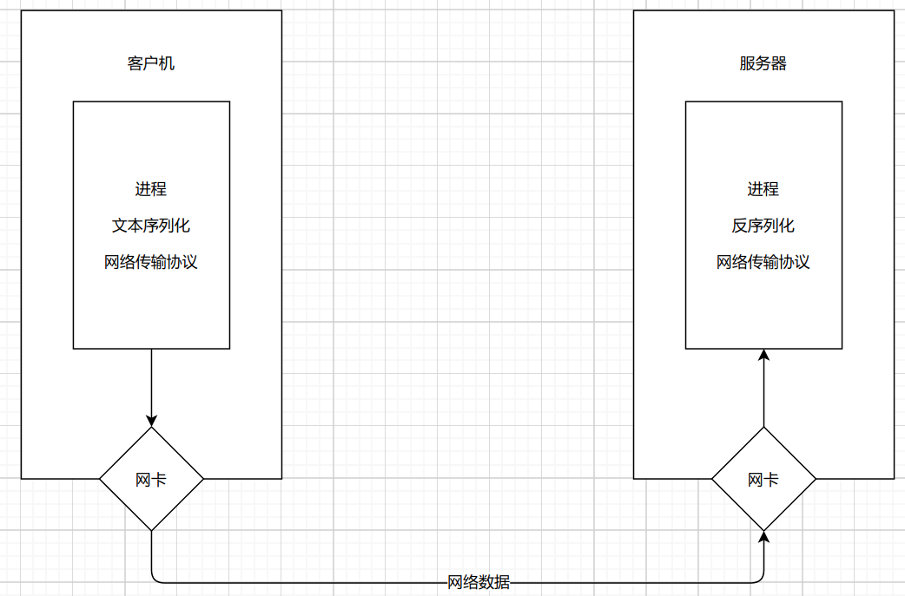
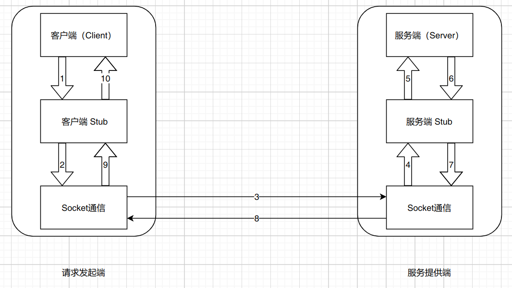
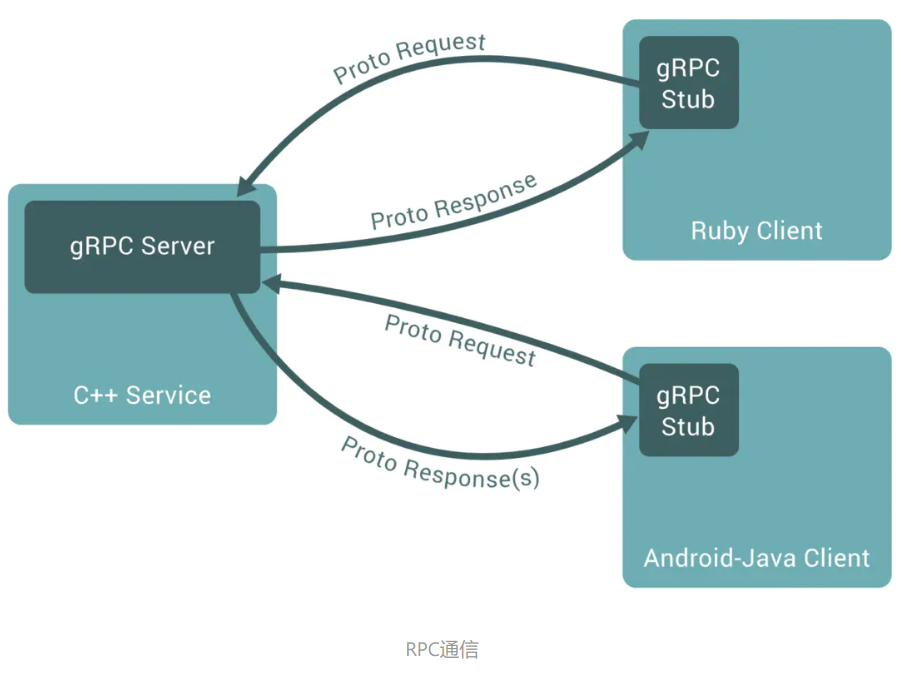

# 1. python - rpc入门

## 1.1 什么是rpc

1. `RPC`(Remote Procedure Call) 远程过程调用，简单的理解是一个节点请求另一个节点提供的服务
2. 对应`rpc`的是本地过程调用，函数调用时最常见的本地过程调用
3. 将本地过程调用变成远程过程调用会面临各种问题

## 1.2 本地过程调用

```python
def add(a,b):
    total = a + b
    return total

total = add(1,2)
print(total)
```

函数调用过程：

1. 将1,2 压入`add`函数的栈
2. 进入`add`函数，从栈中取出1和2分别赋值给a和b
3. 执行`a+b`将结果赋值给局部的`total`并压栈
4. 将栈中的值取出来赋值给全局的`total`

## 1.3 远程过程面临的问题

原本的本地函数放到另一个服务器上去运行。但是引入了很多新问题

### 1.3.1 `Call`的`Id`映射

在本地调用中，函数体时直接通过函数指针来指定的，调用函数，编译器自动调用它相应的函数指针。但在远程调用中，函数指针是不行，因为两个进程的地址空间是完全不一样的，所以，在`RPC`中，所有的函数都必须有自己的一个`ID`。这个`ID`在是所有进程中都是唯一确定的。客户端在做远程调用时，必须附上这个`ID`，然后还需要在客户端和服务器端分别维护一个{函数<-->Call ID}的对应表。两者的表不一定需要完全相同，但相同函数对应的`Call ID`必须相同。当客户端需要进行远程调用时，他它就查一下这个表，找出相应的`Call ID`，然后把它传给服务端，服务端也通过查表，来确定客户端需要调用的函数，然后执行相应函数的代码。

### 1.3.2 序列化和反序列化

客户端怎么把参数值传给远程的函数？

在本地调用中，我们只需要把参数压到栈里，然后让函数自己去栈里读就行。但是在远程过程调用中，客户端和服务端是不同的进程，不能通过内存来传递参数。甚至有的时候客户端和服务器端使用的都不是同一种语言（比如服务器端用C++，客户端用Java或者Python）这时候就需要客户端把参数先转成一个字节流，传给服务端后，再把字节流，转成自己能读取的格式。这个过程叫序列化和反序列化。同理，从服务端返回的值也需要序列化反序列化的过程。

### 1.3.3 网络传输

远程调用往往用在网络上，客户端和服务端是通过网络连接的。所有的数据都需要通过网络传输，因此就需要有一个网络传输层。网络传输层需要把 `Call ID`和序列化后的参数字节流传给服务端，然后再把序列化后的调用结果传回客户端。只要能完成这两者的，都可以作为传输层使用。因此，它使用协议其实是不限的，能完成传输就行。尽管大部分`RPC`框架都使用`TCP`协议，但其实`UDP`也可以，而`gRPC`干脆就用了`HTTP2`。java的`Netty`也属于这层的东西。

## 1.4 RPC具体实现过程



### 1.4.1 Client 端解决的问题

1. 将这个调用映射为`Call ID`。这里假设用最简单的字符串`Call ID`的方法
2. 将`Call ID a`和`b`序列化。可以将它们的值以二进制的形式打包
3. 把2中得到数据包发送给`ServerAddr`，这需要使用网络传输层
4. 等待服务器返回结果
5. 如果服务器调用成功，那么就将结果反序列化


### 1.4.2 Server端解决的问题

1. 在本地维护一个`Call ID`的函数指针的映射`call_id_map`，可以用`dict`完成
2. 等待请求，包括多线程的并发处理能力
3. 得到一个请求后，将其数据包反序列化，得到`Call_ID`
4. 通过在`call_id_map`中查找，得到相应的函数指针
5. 将`a`和`b`反序列化后，在本地调用add函数，得到结果
6. 将结果序列化后通过网络返回给`Client`


### 1.4.3 小结

要实现一个`RPC`框架按照以上流程实现就基本完成

其中：

1. `Call ID`映射可以直接使用函数字符串，也可以使用整数`ID`。映射表一般是一个哈希表
2. 序列化和反序列化也可以自己写，也可以使用`Protobuf`或者`flatBuffers`之类的
3. 网络传输库可以自己写`socket`，或者用`asio`，`ZeroMQ`,`Netty` 之类

实际上，真正的开发过程中，除了上面的基本功能外，还需要更多的细节：网络错误，流量控制，超时和重试等。

> 如何将远程的这些过程写出本地函数调用的感觉？


## 1.5 rpc , http以及restful之间的区别

### 1.5.1 rpc 和  http

要解决`rpc`的调用问题，需要解决两个非常重要的问题：

1. 序列化和反序列化
2. 网络传输协议（`http`还是`tcp`协议）

`http`本身属于网络传输协议的一种，`rpc`要实现目的必须依赖网络传输协议

`http`只是实现`rpc`框架的一种选择而已，`rpc`和`http`之间不是竞争关系


### 1.5.1 rpc 和 restful

这两个不是互斥的，`rpc`和`restful`不是非此即彼的，一般服务想要对外提供的时候一般采用的`http`请求，但是这么多接口按照什么规范放出去，这就是`restful`，当然`restful`只是一个规范而已，你完全可以不遵守。`rpc`一般是系统内部服务之间调用，其中`rpc`的协议灵活性会使得我们的传输性更高，但是因为使用不方便所以一般在系统内部组件之间调用的时候使用


## 1.6 通过  httpserver 实现 rpc

首先明确一点：一定会发起一个网络请求，一定会有一个网络连接`tcp/udp`

`remote_add.py`

```python
#!/usr/bin/env python
# coding=utf-8
'''
@file	remote_add.py
@author	helenfrank(helenfrank@protonmail.com)
@date	2021-07-25 21:58:10
'''

import json
from http.server import HTTPServer, BaseHTTPRequestHandler
from urllib.parse import urlparse, parse_qsl

host = ('', 8003)


class AddHandler(BaseHTTPRequestHandler):
    def do_GET(self):
        parse_url = urlparse(self.path)
        qs = dict(parse_qsl(parse_url.query))
        a = int(qs.get("a", 0))
        b = int(qs.get("b", 0))
        self.send_response(200)
        self.send_header("content-type", "application/json")
        self.end_headers()
        self.wfile.write(json.dumps({
            "result": a+b
        }).encode("utf-8"))


if __name__ == "__main__":
    server = HTTPServer(host, AddHandler)
    print("启动服务器")
    server.serve_forever()

```

`rpc_client.py`

```python
#!/usr/bin/env python
# coding=utf-8
'''
@file	rpc_client.py
@author	helenfrank(helenfrank@protonmail.com)
@date	2021-07-25 22:11:17
'''


import requests
import json
a

class Client:
    def __init__(self, url):
        self.url = url

    def add(self, a, b):
        rsp = requests.get(f"{self.url}/?a={a}&b={b}")
        return json.loads(rsp.text).get("result", 0)


client = Client("http://127.0.0.1:8003")
print(client.add(3, 2))

```


## 1.7 rpc 开发的要素分析

### 1.7.1 `rpc` 开发的四大要素

`rpc`技术在架构设计上由四部分组成，分别是：`客户端`，`客户端存根`，`服务端`，`服务端存根`。

- 客户端`Client`：服务调用发起方，也成为服务消费者。
- 客户端存根`Client Stub`：该程序运行在客户端所在的计算机机器上，主要用来存储要调用的服务器地址，另外，该程序还负责将客户端请求远端服务器`Stub`程序发送的调用结果数据包，解析并返回给客户端。
- 服务端`Server`：远端的计算机机器上运行的程序，其中有客户端要调用的方法
- 服务器端存根`Server Stub`：接收客户`Stub`程序通过网络发送的请求消息数据包，并调用服务端中的真正的程序功能方法，完成功能调用；其次，将服务端执行调用的结果进行数据处理打包给客户端`Stub`程序

实际上想要网络中的任意两台计算机上实现远程调用过程，要解决很多问题：

- 两台物理机器在网络中要建立稳定可靠的通信连接
- 两台服务器的通行协议的定义问题，即两台服务器上的程序如何识别对方的请求和返回结果。也就是说，两台计算机必须能够识别对方发来的信息，并且能够识别出其中的请求含义和返回含义，然后才能进行处理。这其实就是通行协议所要完成的工作



在上述图中，通过1-10的步骤图解的形式，说明类RPC每一步的调用过程。具体描述为：

1. 客户端想要发起一个远程过程调用，首先通过调用本地客户端`Stub` 程序的方式调用想要使用的功能方法名
2. 客户端`Stub`程序接收到了客户端的功能调用请求，将客户端请求调用的方法名，携带的参数等信息做序列化操作，并打包成数据包
3. 客户端`Stub`查找到远程服务器程序的`IP`地址，调用`Socket`通信协议，通过网络发送给服务端
4. 服务端`Stub` 程序接收到客户端发送的数据包信息，并通过约定好的协议将数据进行反序列化，得到请求的方法名和请求参数等信息
5. 服务端`Stub`程序准备相关数据，调用本地`Server`对应的功能方法进行，并传入相应的参数，进行业务处理
6. 服务端程序根据已有业务逻辑执行调用过程，待业务执行结束，将执行结果返回给服务端`Stub`程序
7. 服务端`Stub`程序将程序调用结果按照约定的协议进行序列化，并通过网络发送回给客户端`Stub`程序
8. 客户端`Stub`程序接收到服务端`Stub`发送的返回数据，对数据进行反序列化操作，并将调用返回的数据传递给客户端请求发起者
9. 客户端请求发起者得到调用结果，整个`RPC`调用过程结束


### 1.7.2 rpc术语

1. `动态代理技术`：上面的`Client Stub`和`Server Stub` 程序，在具体的编码和开发实践中，都是使用动态代理技术自动生成的一段程序
2. `序列化和反序列化`：在`RPC`调用的过程中，数据需要在一台机器上传输到另外一台机器上。在互联网上，所有的数据都是以字节的形式进行传输的。而在编程过程中，往往使用数据对象，因此想要在网络上将数据对象和相关变量进行传输，就要对数据对象做序列化和反序列化的操作
   - `序列化`：把对象转换为字节序列的过程称为对象的序列化，也就是`编码`的过程
   - `反序列化`：把字节序列恢复为对象的过程称为对象的反序列化，也就是`解码`的过程

常见的`json`，`XML`等相关框架都可以对数据做序列化和反序列化操作。 `Protobuf`协议，也是一种数据编码的协议，在 `RPC`框架中使用的更广泛。


## 1.8 基于 xml 的rpc调用

`xml_rpc_server.py`

```python
#!/usr/bin/env python
# coding=utf-8
'''
@file	xml_rpc_server.py
@author	helenfrank(helenfrank@protonmail.com)
@date	2021-07-26 18:57:18
'''


from xmlrpc.server import SimpleXMLRPCServer

# python 中类的命令方法遵循驼峰命令法
class Calculate:
    def add(self, x, y):
        return x + y

    def multiply(self, x, y):
        return x * y

    def subtract(self, x, y):
        return abs(x - y)

    def divide(self, x, y):
        return x / y

obj = Calculate()
server = SimpleXMLRPCServer(("localhost", 8088))

# 将实例注册给rpc server
server.register_instance(obj)
print("Listening on port 8088")
server.serve_forever()


```


`xml_rpc_client.py`

```python
#!/usr/bin/env python
# coding=utf-8
'''
@file	xml_rpc_client.py
@author	helenfrank(helenfrank@protonmail.com)
@date	2021-07-26 19:29:41
'''


from xmlrpc import client

server = client.ServerProxy("http://localhost:8088")
print(server.add(2,3))

```


## 1.9 json 实现rpc的调用

很多web框架自身都实现了`json-rpc`，独立于这些框架外，一种比较干净的解决方案[jsonrpclib](https://github.com/tcalmant/jsonrpclib)

安装`jsonrpclib`

```bash
pip install jsonrpclib-pelix
```


`rpc_json_server.py`

```python
#!/usr/bin/env python
# coding=utf-8
'''
@file	rpc_json_server.py
@author	helenfrank(helenfrank@protonmail.com)
@date	2021-07-26 20:21:12
'''


from jsonrpclib.SimpleJSONRPCServer import SimpleJSONRPCServer

def add(a, b):
    return a + b

# 1. 实例化 server
server = SimpleJSONRPCServer(('localhost', 8080))

# 2. 将函数注册到server中
server.register_function(add)

# server.register_function(pow)
# server.register_function(lambda x,y: x+y, 'add')
# server.register_function(lambda x: x, 'ping')

# 3. 启动server
server.serve_forever()

```


`rpc_json_client.py`

```python
import jsonrpclib

server = jsonrpclib.ServerProxy('http://localhost:8080')

print(server.add(2,3))

```


**多线程解决方案**

`thread_pool_server.py`

```python
#!/usr/bin/env python
# coding=utf-8
'''
@file	thread_pool_server.py
@author	helenfrank(helenfrank@protonmail.com)
@date	2021-07-26 20:32:49
'''


from jsonrpclib.SimpleJSONRPCServer import SimpleJSONRPCServer
from jsonrpclib.threadpool import ThreadPool

def add(a, b):
    return a + b

# Setup the thread pool: between 0 and 10 threads
pool = ThreadPool(max_threads=10, min_threads=0)

# Don't forget to start it
pool.start()

# Setup the server
server = SimpleJSONRPCServer(('localhost', 8080))
server.set_notification_pool(pool)

# Register methods
server.register_function(add)

# 1. 超时机制 - 重试
# 2. 限流 处于长期可用的状态 - 高可用
# 3. 解耦
# 4. 负载均衡 微服务 - 分布式应用的一种具体的体现
# 5. json-rpc 是否满足上述的要求
# 6. 序列化和反序列化数据压缩是否高效


# server.register_function(pow)
# server.register_function(lambda x, y: x+y, 'add')
# server.register_function(lambda x: x, 'ping')

try:
    server.serve_forever()
finally:
    # Stop the thread pool (let threads finish their current task)
    pool.stop()
    server.set_notification_pool(None)

```


`thread_pool_client.py`

```python

#!/usr/bin/env python
# coding=utf-8
'''
@file	thread_pool_client.py
@author	helenfrank(helenfrank@protonmail.com)
@date	2021-07-26 21:08:59
'''


import jsonrpclib
import threading
import time

def request():
    server = jsonrpclib.ServerProxy('http://localhost:8080')
    print(server.add(2,3))


for i in range(10):
    thread = threading.Thread(target=request)
    thread.start()
time.sleep(30)


```


## 1.10 zerorpc 实现rpc调用

[zerorpc-python](https://github.com/0rpc/zerorpc-python)是利用 `zeroMQ`消息队列 `+` `msgpack`消息序列化（二进制）来实现类似`grpc`的功能，跨语言远程调用。

主要使用到`zeroMQ`的通信模式是`ROUTER-DEALER`，模拟`grpc`的 `请求-响应式` 和 `应答流式`RPC:

`zerorpc`还支持`PUB-SUB`通信模式的远程调用

​	`zerorpc`实际上会依赖`msgpack-python`，`pyzmq`，`future`，`greenlet`，`gevent`


### 1.10.1 安装

```bash
pip install zerorpc
```


### 1.10.2 基本使用

1. 创建一个基本服务

   ```bash
   zerorpc --server --bind tcp://*:1234 time
   ```

2. 调用

   ```python
   zerorpc --client --connect tcp://127.0.0.1:1234 strftime %Y/%m/%d
   ```

3. 查看远程服务的文档

   ```bash
   zerorpc tcp://127.0.0.1:1234
   ```


### 1.10.3 一元调用

1. 服务端

   ```python
   #!/usr/bin/env python
   # coding=utf-8
   '''
   @file	1_server.py
   @author	helenfrank(helenfrank@protonmail.com)
   @date	2021-07-26 22:36:03
   '''
   
   
   import zerorpc
   
   
   class HelloRPC(object):
       def hello(self, name):
           return "Hello,%s" % name
   
   
   s = zerorpc.Server(HelloRPC())
   s.bind("tcp://0.0.0.0:4242")
   s.run()
   
   ```

2. 客户端

   ```python
   #!/usr/bin/env python
   # coding=utf-8
   '''
   @file	1_client.py
   @author	helenfrank(helenfrank@protonmail.com)
   @date	2021-07-26 22:38:36
   '''
   
   
   import zerorpc
   
   c = zerorpc.Client()
   c.connect("tcp://127.0.0.1:4242")
   print(c.hello("helen"))
   
   ```


### 1.10.4 流式响应

`zero_stream_server.py`

```python
#!/usr/bin/env python
# coding=utf-8
'''
@file	2_server.py
@author	helenfrank(helenfrank@protonmail.com)
@date	2021-07-27 09:57:58
'''


import zerorpc

class StreamingRPC(object):
    @zerorpc.stream  # @zerorpc.stream  这里的函数修饰是必须的，否则会有异常，如TypeError:
    def streaming_range(self, fr, to, step):
        return range(fr, to, step)

s = zerorpc.Server(StreamingRPC())
s.bind("tcp://0.0.0.0:4242")
s.run()

```


`zero_stream_client.py`

```python
#!/usr/bin/env python
# coding=utf-8
'''
@file	2_client.py
@author	helenfrank(helenfrank@protonmail.com)
@date	2021-07-27 10:01:23
'''


import zerorpc

c = zerorpc.Client()
c.connect("tcp://127.0.0.1:4242")

for item in c.streaming_range(10, 20, 2):
    print(item)

```


### 1.10.5 传入多个参数

`zero_stream_n_server.py`

```python
#!/usr/bin/env python
# coding=utf-8
'''
@file	zero_stream_n_server.py
@author	helenfrank(helenfrank@protonmail.com)
@date	2021-07-27 16:00:24
'''


import zerorpc


class myRPC(object):
    def listinfo(self, message):
        return "get info : %s" % message

    def getpow(self, n, m):
        return n ** m


s = zerorpc.Server(myRPC())
s.bind("tcp://0.0.0.0:4242")

```


`zero_stream_n_client.py`

```python
#!/usr/bin/env python
# coding=utf-8
'''
@file	zero_stream_n_client.py
@author	helenfrank(helenfrank@protonmail.com)
@date	2021-07-27 16:03:14
'''

import zerorpc

c = zerorpc.Client()
c.connect("tcp://127.0.0.1:4242")

print(c.listinfo("this is test string"))

print(c.getpow(2, 5))

```


# 2. go - rpc

## 2.1 简单体验


`server.go`

```go
/*
	@file	server.go
	@author	helenfrank(helenfrank@protonmail.com)
	@date	2021-07-27 17:35:01
*/

package main

import (
	"net"
	"net/rpc"
)

type HelloService struct {
}

func (s *HelloService) Hello(request string, reply *string) error {
	// 返回值是通过修改reply的值
	*reply = "hello," + request
	return nil
}

func main() {
	// 1. 实例化一个server
	listener, _ := net.Listen("tcp", ":2021")

	// 2. 注册处理逻辑 handler
	rpc.RegisterName("h", &HelloService{})

	// 3. 启动服务
	conn, _ := listener.Accept()
	rpc.ServeConn(conn)
}

```


`client.go`

```go
/*
	@file	client.go
	@author	helenfrank(helenfrank@protonmail.com)
	@date	2021-07-27 17:51:46
*/

package main

import (
	"fmt"
	"net/rpc"
)

func main() {
	client, err := rpc.Dial("tcp", "localhost:2021")
	if err != nil {
		panic("连接错误")
	}
	var reply *string = new(string)
	err = client.Call("h.Hello", "bobby", reply)
	if err != nil {
		panic("调用失败")
	}
	fmt.Println(*reply)

}

```


> go 语言rpc的序列化协议是`Gob`,这是go特有的


## 2.2 替换rpc的序列化协议为 json

**服务器端**

`server.go`

```go
/*
	@file	client.go
	@author	helenfrank(helenfrank@protonmail.com)
	@date	2021-07-27 18:09:55
*/

package main

import (
	"net"
	"net/rpc"
	"net/rpc/jsonrpc"
)

type JsonService struct {
}

func (js *JsonService) J(request string, s *string) error {
	*s = "123," + request
	return nil
}

func main() {
	listener, _ := net.Listen("tcp", ":2021")

	rpc.RegisterName("js", &JsonService{})

	for {
		conn, _ := listener.Accept()

		go rpc.ServeCodec(jsonrpc.NewServerCodec(conn))
	}

}

```


**客户端**

`go_client.go`

```go
/*
	@file	client.go
	@author	helenfrank(helenfrank@protonmail.com)
	@date	2021-07-27 18:46:12
*/

package main

import (
	"fmt"
	"net"
	"net/rpc"
	"net/rpc/jsonrpc"
)

func main() {
	conn, err := net.Dial("tcp", ":2021")
	if err != nil {
		panic("连接失败")
	}
	var replay string

	client := rpc.NewClientWithCodec(jsonrpc.NewClientCodec(conn))

	err = client.Call("js.J", "abc", &replay)
	if err != nil {
		panic("调用失败")
	}
	fmt.Println(replay)
}

// 发送的json数据包
// {"method":"js.J","params":["abc"],"id":0}

```


`py_client.py`

```python
#!/usr/bin/env python
# coding=utf-8
'''
@file	go_json_rpc_client.py
@author	helenfrank(helenfrank@protonmail.com)
@date	2021-07-27 19:06:10
'''


# import requests

# requests.get("")  # 这是一个http的库，发送出去的文本都是http协议的文本

import json
import socket

request = {
    "id": 0,
    "params": ["python - json"],
    "method":"js.J"
}

client  = socket.create_connection(("localhost",2021))

client.sendall(json.dumps(request).encode())


# 获取服务器返回的数据
rsp = client.recv(1024)
rsp = json.loads(rsp.decode())

print(rsp['result'])

```


### 2.3.1 优化，解耦

`server.go`

```go
/*
	@file	client.go
	@author	helenfrank(helenfrank@protonmail.com)
	@date	2021-07-27 18:09:55
*/

package main

import (
	"2_json_rpc_plus/handler"
	"2_json_rpc_plus/server_proxy"
	"net"
	"net/rpc"
)

func main() {
	listener, _ := net.Listen("tcp", ":2021")
	server_proxy.RegisterJsonService(&handler.JsonService{})

	for {
		conn, _ := listener.Accept()

		go rpc.ServeConn(conn)
	}

}

```

`server_proxy.go`

```go
/*
	@file	server_proxy.go
	@author	helenfrank(helenfrank@protonmail.com)
	@date	2021-07-29 15:02:05
*/

package server_proxy

import (
	"2_json_rpc_plus/handler"
	"net/rpc"
)

type JsonServicer interface {
	J(request string, reply *string) error
}

// 做到解耦  关心的是函数  鸭子类型
func RegisterJsonService(srv JsonServicer) error {
	return rpc.RegisterName(handler.Js, srv)
}

```

`handler.go`

```go
/*
	@file	handler.go
	@author	helenfrank(helenfrank@protonmail.com)
	@date	2021-07-28 10:39:22
*/

package handler

const Js = "handler/js"

type JsonService struct {
}

func (js *JsonService) J(request string, s *string) error {
	*s = "123," + request
	return nil
}

```

`client.go`

```go
/*
	@file	client.go
	@author	helenfrank(helenfrank@protonmail.com)
	@date	2021-07-27 18:46:12
*/

package main

import (
	"2_json_rpc_plus/client_proxy"
	"fmt"
)

func main() {
	client := client_proxy.NewJsonServiceClient("tcp", ":2021")
	var replay string

	err := client.J("abc", &replay)
	if err != nil {
		fmt.Println(err)
		panic("调用失败")
	}
	fmt.Println(replay)
}

```

`client_proxy.go`

```go
package client_proxy

import (
	"2_json_rpc_plus/handler"
	"fmt"
	"net/rpc"
)

type JsonServiceStub struct {
	*rpc.Client
}

func NewJsonServiceClient(protol, address string) JsonServiceStub {
	conn, err := rpc.Dial(protol, address)
	if err != nil {
		panic("connect error")
	}
	return JsonServiceStub{conn}
}

func (c *JsonServiceStub) J(request string, reply *string) error {
	err := c.Call(handler.Js+".J", request, reply)
	if err != nil {
		fmt.Println("J ", err)
		return err
	}
	return nil
}

```


## 2.3  http rpc

`server.go`

```go
/*
	@file	client.go
	@author	helenfrank(helenfrank@protonmail.com)
	@date	2021-07-27 18:09:55
*/

package main

import (
	"io"
	"net/http"
	"net/rpc"
	"net/rpc/jsonrpc"
)

type JsonService struct {
}

func (js *JsonService) J(request string, s *string) error {
	*s = "123," + request
	return nil
}

func main() {
	rpc.RegisterName("Js", &JsonService{})

	http.HandleFunc("/jsonrpc", func(w http.ResponseWriter, r *http.Request) {
		var conn io.ReadWriteCloser = struct {
			io.Writer
			io.ReadCloser
		}{
			ReadCloser: r.Body,
			Writer:     w,
		}

		rpc.ServeRequest(jsonrpc.NewServerCodec(conn))
	})
	http.ListenAndServe(":2021", nil)
}

```


`client.py`

```python
import requests

request = {
    "id": 0,
    "params": ["python http json"],
    "method": "Js.J"
}
rsp = requests.post("http://127.0.0.1:2021/jsonrpc", json=request)

print(rsp.text)

```


# 3. grpc入门


## 3.1 什么是 grpc 和 protobuf

[grpc](https://grpc.io/)是一个高性能，开源和通用的`RPC`框架，面向移动和`HTTP/2`设计。目前提供`C`,`Java`和`Go`语言版本分别是[grpc](https://github.com/grpc/grpc)  ,  [grpc-java](https://github.com/grpc/grpc-java)  ,  [grpc-go](https://github.com/grpc/grpc-go)，其中`C`版本要支持`C`,`C++`,`Node.js`,`Python`,`Ruby`,`Objective-C`,`PHP`和`C#`支持



**protobuf**

`Protocol Buffer`其实是`Google`出品的一种轻量&高效的结构化数据存储格式，性能比`Json `,`XML`强很多

`protobuf`经历了`protobuf2`和`protobuf3`，`pb3`比`pb2`简化很多，目前主流的版本是`pb3`

1. Protobuf 优点

   性能方面 :

   - **体积小** : Protobuf 序列化后 , 体积小 , 序列化后 , 大约是 JSON / XML 等文本方式的 $\cfrac{1}{3} $​​​​; 序列化后可操作性高 , 存储时占用的空间少 , 传输时 , 消耗更少的带宽 ;
   - **序列化速度快** : Protobuf 序列化速度快 , 转换速度是 JSON / XML 的2-100倍 ;

   在使用方面 , Protobuf

   - **使用简单** ,
   - **维护成本低** ,
   - **向后兼容** ,
   - **加密性好** ;

   使用范围方面 , Protobuf 可以

   - **跨平台** ( MAC / Linux / Windows / Android / iOS ) ,
   - **跨语言** ( Java / Python / C / C++ / … ) ,
   - **可扩展** ;

2. Protobuf 缺点

   **通用性较差** : 目前 XML / JSON 广泛使用 , 是行业标准的序列化 , 反序列化格式 ;

   **自解释性差** : 序列化 , 反序列化 Protobuf , 需要有 Protobuf 源文件才可以进行 ;	


## 3.2 python 下的 protobuf 体验

### 3.2.1 安装

`grpc`内置了对`protobuf`的支持

```bash
# 安装grpc
python -m pip install grpcio
# 安装grpc tools
python -m pip install grpcio-tools
```

### 3.2.2 入门

`protobuf3` 是有自己专门的定义格式的

`proto/hello.proto`

```protobuf
syntax = "proto3";

message HelloRequest {
    string name = 1;  // name 表示名称  ，  name的编号是1
}

```

### 3.2.3 生成proto的python文件

```bash
python -m grpc_tools.protoc --python_out=. --grpc_python_out=. -I. hello.proto
```

### 3.2.4  测试

`client.py`

```python
#!/usr/bin/env python
# coding=utf-8
'''
@file	client.py
@author	helenfrank(helenfrank@protonmail.com)
@date	2021-07-29 18:23:01
'''


from proto import hello_pb2

request = hello_pb2.HelloRequest()
request.name = "helen"
res_str=request.SerializeToString()
print(res_str)

# 如何通过字符串反向生成对象

request2 = hello_pb2.HelloRequest()
request2.ParseFromString(res_str)
print(request2.name)

```


## 3.3 python体验grpc开发

`helloworld.proto`

```protobuf
// Copyright 2015 gRPC authors.
//
// Licensed under the Apache License, Version 2.0 (the "License");
// you may not use this file except in compliance with the License.
// You may obtain a copy of the License at
//
//     http://www.apache.org/licenses/LICENSE-2.0
//
// Unless required by applicable law or agreed to in writing, software
// distributed under the License is distributed on an "AS IS" BASIS,
// WITHOUT WARRANTIES OR CONDITIONS OF ANY KIND, either express or implied.
// See the License for the specific language governing permissions and
// limitations under the License.

syntax = "proto3";

// option java_multiple_files = true;
// option java_package = "io.grpc.examples.helloworld";
// option java_outer_classname = "HelloWorldProto";
// option objc_class_prefix = "HLW";

// package helloworld;

// The greeting service definition.
service Greeter {
  // Sends a greeting
  rpc SayHello(HelloRequest) returns (HelloReply) {}
}

// The request message containing the user's name.
message HelloRequest { string name = 1; }

// The response message containing the greetings
message HelloReply { string message = 1; }

```


```bash
 python -m grpc_tools.protoc --python_out=. --grpc_python_out=. -I. hellowrold.proto
```


`server.py`

```python
from concurrent import futures

import grpc


from proto import helloworld_pb2,helloworld_pb2_grpc


class Greeter(helloworld_pb2_grpc.GreeterServicer):
    def SayHello(self, request, context):
        return helloworld_pb2.HelloReply(message=f"你好,{request.name}")


if __name__ == "__main__":
    # 1. 实例化server
    server = grpc.server(futures.ThreadPoolExecutor(max_workers=10))

    # 2. 注册逻辑到 server 中
    helloworld_pb2_grpc.add_GreeterServicer_to_server(Greeter(), server)

    # 3. 启动server
    server.add_insecure_port("0.0.0.0:2021")
    server.start()
    server.wait_for_termination()

```


`client.py`

```python
import grpc
from proto import helloworld_pb2, helloworld_pb2_grpc

if __name__ == "__main__":
    with grpc.insecure_channel("127.0.0.1:2021") as channel:
        stub = helloworld_pb2_grpc.GreeterStub(channel)
        rsp: helloworld_pb2.HelloReply =  stub.SayHello(helloworld_pb2.HelloRequest(name="helen"))
        print(rsp.message)

```


## 3.4 go 体验 grpc开发

[protobuf](https://github.com/protocolbuffers/protobuf) 下载安装 [博客](https://www.jianshu.com/p/00be93ed230c)


下载go的依赖包

```bash
go get -u google.golang.org/grpc
go get -u github.com/golang/protobuf/protoc-gen-go

```


`hello.proto`

```protobuf
syntax = "proto3";
option go_package = ".;proto";

service Greeter { rpc SayHello(HelloRequest) returns (HelloReply); }

message HelloRequest { string name = 1; }

message HelloReply { string message = 1; }

```


```bash
protoc -I . hello.proto  --go_out=plugins=grpc:.
```


`server/server.go`

```go
package main

import (
	"3_go_grpc/proto"
	"context"
	"net"

	"google.golang.org/grpc"
)

type Server struct{}

func (c *Server) SayHello(ctx context.Context, request *proto.HelloRequest) (*proto.HelloReply, error) {
	return &proto.HelloReply{
		Message: "hello " + request.Name,
	}, nil
}

func main() {
	g := grpc.NewServer()
	proto.RegisterGreeterServer(g, &Server{})
	lis, err := net.Listen("tcp", "0.0.0.0:2021")
	if err != nil {
		panic("failed to listen: " + err.Error())
	}
	err = g.Serve(lis)
	if err != nil {
		panic("failed to start grpc: " + err.Error())
	}
}

```


`client/client.go`

```go
/*
	@file	client.go
	@author	helenfrank(helenfrank@protonmail.com)
	@date	2021-07-30 11:34:33
*/

package main

import (
	"3_go_grpc/proto"
	"context"
	"fmt"

	"google.golang.org/grpc"
)

func main() {
	conn, err := grpc.Dial("127.0.0.1:2021", grpc.WithInsecure())
	if err != nil {
		panic(err)
	}
	defer conn.Close()

	c := proto.NewGreeterClient(conn)
	r, err := c.SayHello(context.Background(), &proto.HelloRequest{Name: "helen"})
	if err != nil {
		panic(err)
	}
	fmt.Println(r.Message)
}

```


## 3.5 grpc 的四种数据流

`stream`顾名思义就是一种流，可以源源不断的推送数据，很适合传输一些大数据，或者服务端和客户端长时间数据交互，比如客户端可以向服务端订阅一个数据，服务端就可以利用stream，源源不断地推送数据


### 3.5.1 简单模式(Simple RPC)

这种模式最为传统，即客户端发起一次请求，服务端响应一个数据


### 3.5.2 服务端数据流模式(Server-side streaming RPC)

这种模式是客户端发起一次请求，服务端返回一段连续的数据流。典型的例子是客户端向服务端发送一个股票代码，服务端就把该股票的实时数据源源不断的返回给客户端


### 3.5.3 客户端数据流模式(Client-side streaming RPC)

与服务端流模式相反，这次是客户端源源不断的向服务端发送数据流，而在发送结束后，由服务端返回一个响应。典型的例子是物联网终端向服务器报送数据


### 3.5.4 双向数据流模式(Bidirectional streaming RPC)

顾名思义，这是客户端和服务端都可以向对方发送数据流，这个时候双方的数据可以同时互相发送，也就是可以实现实时交互。典型的例子就是聊天机器人


代码

`/proto/stream.proto`

```protobuf
syntax = "proto3";

option go_package = ".;proto";

service Greeter {
  rpc GetStream(StreamReqData) returns (stream StreamResData); // 服务端流模式
  rpc PutStream(stream StreamReqData) returns (StreamResData); // 客户端流模式
  rpc AllStream(stream StreamReqData)
      returns (stream StreamResData); // 双向流模式
}

message StreamReqData { string data = 1; }

message StreamResData { string data = 1; }

```


```bash
protoc -I . stream.proto  --go_out=plugins=grpc:.
```


`/server/server.go`

```go
/*
	@file	server.go
	@author	helenfrank(helenfrank@protonmail.com)
	@date	2021-07-30 14:19:26
*/

package main

import (
	"4_stream_test/proto"
	"fmt"
	"net"
	"sync"
	"time"

	"google.golang.org/grpc"
)

const PORT = ":2021"

type server struct {
}

func (s *server) GetStream(req *proto.StreamReqData, res proto.Greeter_GetStreamServer) error {
	for i := 0; ; i++ {
		res.Send(&proto.StreamResData{
			Data: fmt.Sprintf("%v", time.Now().Unix()),
		})
		time.Sleep(time.Second)
		if i > 10 {
			break
		}
	}

	return nil
}
func (s *server) PutStream(cliStr proto.Greeter_PutStreamServer) error {
	for {
		if a, err := cliStr.Recv(); err != nil {
			fmt.Println(err)
			break
		} else {
			fmt.Println(a.Data)
		}

	}
	return nil
}
func (s *server) AllStream(allStr proto.Greeter_AllStreamServer) error {
	wg := sync.WaitGroup{}
	wg.Add(2)
	go func() {
		defer wg.Done()
		for {
			data, _ := allStr.Recv()
			fmt.Println("收到客户端消息：" + data.Data)
		}

	}()

	go func() {
		defer wg.Done()
		for {
			_ = allStr.Send(&proto.StreamResData{
				Data: "I is server",
			})
			time.Sleep(time.Second)

		}

	}()
	wg.Wait()
	return nil
}
func main() {
	lis, err := net.Listen("tcp", PORT)
	if err != nil {
		panic(err)
	}
	s := grpc.NewServer()
	proto.RegisterGreeterServer(s, &server{})
	err = s.Serve(lis)
	if err != nil {
		panic(err)
	}
}

```


`client/client.go`

```go
/*
	@file	client.go
	@author	helenfrank(helenfrank@protonmail.com)
	@date	2021-07-30 14:31:51
*/

package main

import (
	"4_stream_test/proto"
	"context"
	"fmt"
	"sync"
	"time"

	"google.golang.org/grpc"
)

func main() {
	conn, err := grpc.Dial("127.0.0.1:2021", grpc.WithInsecure())
	if err != nil {
		panic(err)
	}
	defer conn.Close()
	c := proto.NewGreeterClient(conn)

	// // 服务端流模式
	// res, _ := c.GetStream(context.Background(), &proto.StreamReqData{Data: "helen"})

	// for {
	// 	a, err := res.Recv()
	// 	if err != nil {
	// 		fmt.Println(err)
	// 		break
	// 	}
	// 	fmt.Println(a)
	// }

	// // 客户端流模式
	// putS, _ := c.PutStream(context.Background())
	// for i := 0; i < 10; i++ {
	// 	putS.Send(&proto.StreamReqData{
	// 		Data: fmt.Sprintf("helen%d", i),
	// 	})
	// 	time.Sleep(time.Second)
	// }

	// 双向流模式
	allStr, _ := c.AllStream(context.Background())
	wg := sync.WaitGroup{}
	wg.Add(2)
	go func() {
		defer wg.Done()
		for {
			data, _ := allStr.Recv()
			fmt.Println("收到服务端消息：" + data.Data)
		}

	}()

	go func() {
		defer wg.Done()
		for {
			_ = allStr.Send(&proto.StreamReqData{
				Data: "I is client",
			})
			time.Sleep(time.Second)

		}

	}()
	wg.Wait()

}

```


# 4. grpc和protobuf进阶

## 4.1 protobuf

[protobuf3官方文档](https://developers.google.com/protocol-buffers/docs/proto3)

[protobuf3中文文档](https://colobu.com/2017/03/16/Protobuf3-language-guide)

### 4.1.1 基本数据类型和repeated

#### 4.1.1.1 标量数值类型

| .proto Type | Notes                                                        | C++ Type | Java Type  | Python Type[2] | Go Type | Ruby Type                      | C# Type    | PHP Type       |
| :---------- | :----------------------------------------------------------- | :------- | :--------- | :------------- | :------ | :----------------------------- | :--------- | :------------- |
| double      |                                                              | double   | double     | float          | float64 | Float                          | double     | float          |
| float       |                                                              | float    | float      | float          | float32 | Float                          | float      | float          |
| int32       | 使用变长编码，对于负值的效率很低，如果你的域有可能有负值，请使用sint64替代 | int32    | int        | int            | int32   | Fixnum 或者 Bignum（根据需要） | int        | integer        |
| uint32      | 使用变长编码                                                 | uint32   | int        | int/long       | uint32  | Fixnum 或者 Bignum（根据需要） | uint       | integer        |
| uint64      | 使用变长编码                                                 | uint64   | long       | int/long       | uint64  | Bignum                         | ulong      | integer/string |
| sint32      | 使用变长编码，这些编码在负值时比int32高效的多                | int32    | int        | int            | int32   | Fixnum 或者 Bignum（根据需要） | int        | integer        |
| sint64      | 使用变长编码，有符号的整型值。编码时比通常的int64高效。      | int64    | long       | int/long       | int64   | Bignum                         | long       | integer/string |
| fixed32     | 总是4个字节，如果数值总是比总是比228大的话，这个类型会比uint32高效。 | uint32   | int        | int            | uint32  | Fixnum 或者 Bignum（根据需要） | uint       | integer        |
| fixed64     | 总是8个字节，如果数值总是比总是比256大的话，这个类型会比uint64高效。 | uint64   | long       | int/long       | uint64  | Bignum                         | ulong      | integer/string |
| sfixed32    | 总是4个字节                                                  | int32    | int        | int            | int32   | Fixnum 或者 Bignum（根据需要） | int        | integer        |
| sfixed64    | 总是8个字节                                                  | int64    | long       | int/long       | int64   | Bignum                         | long       | integer/string |
| bool        |                                                              | bool     | boolean    | bool           | bool    | TrueClass/FalseClass           | bool       | boolean        |
| string      | 一个字符串必须是UTF-8编码或者7-bit ASCII编码的文本。         | string   | String     | str/unicode    | string  | String (UTF-8)                 | string     | string         |
| bytes       | 可能包含任意顺序的字节数据。                                 | string   | ByteString | str            | []byte  | String (ASCII-8BIT)            | ByteString | string         |

1. 在java中，无符号32位和64位整型被表示成他们的整型对应形式，最高位被储存在标志位中。
2. 对于所有的情况，设定值会执行类型检查以确保此值是有效。
3. 64位或者无符号32位整型在解码时被表示成为ilong，但是在设置时可以使用int型值设定，在所有的情况下，值必须符合其设置其类型的要求。
4. python中string被表示成在解码时表示成unicode。但是一个ASCIIstring可以被表示成str类型。
5. Integer在64位的机器上使用，string在32位机器上使用


#### 4.1.1.2 默认值

当一个消息被解析的时候，如果被编码的信息不包含一个特定的singular元素，被解析的对象锁对应的域被设置位一个默认值，对于不同类型指定如下：

- 对于string，默认是一个空string
- 对于bytes，默认是一个空的bytes
- 对于bool，默认是false
- 对于数值类型，默认是0
- 对于枚举，默认是第一个定义的枚举值，必须为0;
- 对于消息类型（message），域没有被设置，确切的消息是根据语言确定的，详见[generated code guide](https://developers.google.com/protocol-buffers/docs/reference/overview?hl=zh-cn)

对于可重复域的默认值是空（通常情况下是对应语言中空列表）。

*注：对于标量消息域，一旦消息被解析，就无法判断域释放被设置为默认值（例如，例如boolean值是否被设置为false）还是根本没有被设置。你应该在定义你的消息类型时非常注意。例如，比如你不应该定义boolean的默认值false作为任何行为的触发方式。也应该注意如果一个标量消息域被设置为标志位，这个值不应该被序列化传输。*


#### 4.1.1.3 python中对repeate的操作的坑

实例化后赋值，会出现错误，因为这里已经默认初始化好了，需要当作list来处理，extend 或者 append


