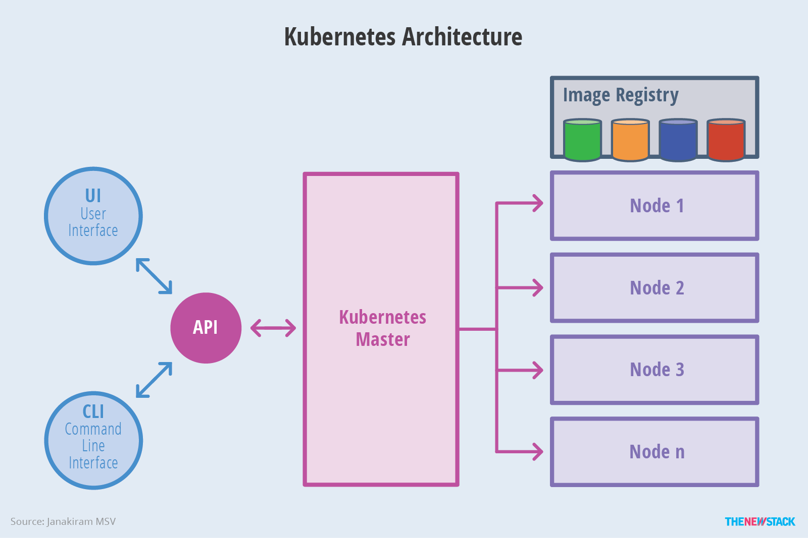
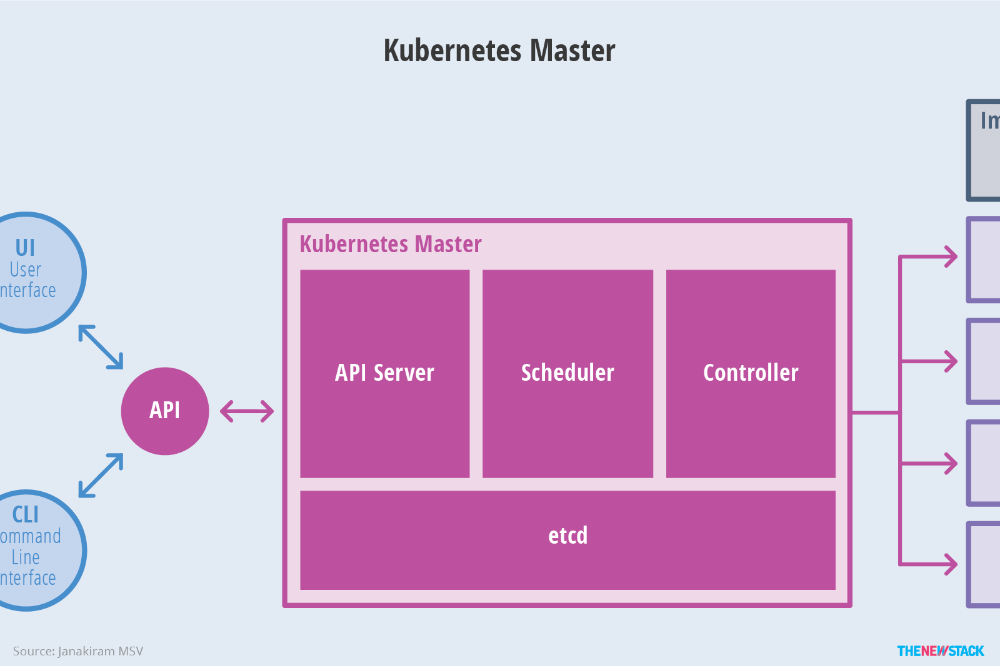
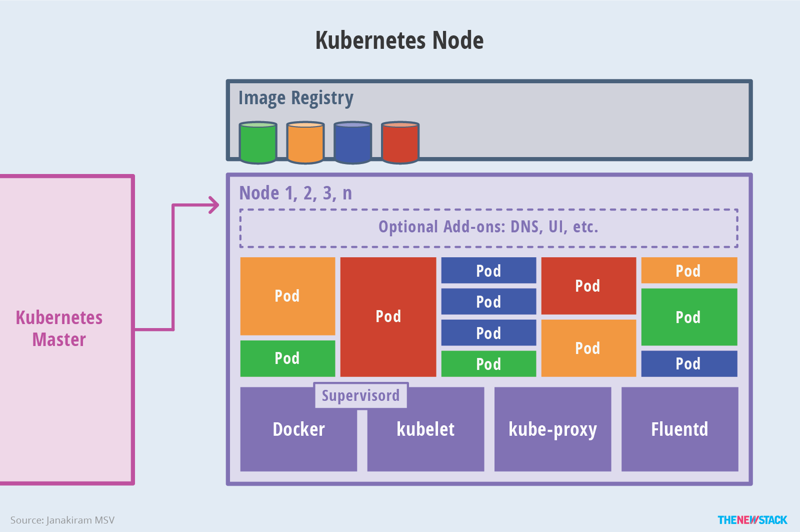

# 1. kubernetes架构

 Kubernetes 主要由以下几个核心组件组成：

- etcd 保存了整个集群的状态；
- apiserver 提供了资源操作的唯一入口，并提供认证、授权、访问控制、API 注册和发现等机制；
- controller manager 负责维护集群的状态，比如故障检测、自动扩展、滚动更新等；
- scheduler 负责资源的调度，按照预定的调度策略将 Pod 调度到相应的机器上；
- kubelet 负责维护容器的生命周期，同时也负责 Volume（CSI）和网络（CNI）的管理；
- Container runtime 负责镜像管理以及 Pod 和容器的真正运行（CRI）；
- kube-proxy 负责为 Service 提供 cluster 内部的服务发现和负载均衡；

除了核心组件，还有一些推荐的插件，其中有的已经成为 CNCF 中的托管项目：

- CoreDNS 负责为整个集群提供 DNS 服务
- Ingress Controller 为服务提供外网入口
- Prometheus 提供资源监控
- Dashboard 提供 GUI
- Federation 提供跨可用区的集群

## 1.1 kubernetes的架构示意图

下图清晰表明了 Kubernetes 的架构设计以及组件之间的通信协议

下面是更抽象的一个视图

### 1.1.1 master架构

### 1.1.2 Node 架构

### 1.1.3 分层架构

Kubernetes 设计理念和功能其实就是一个类似 Linux 的分层架构，如下图所示

- 核心层：Kubernetes 最核心的功能，对外提供 API 构建高层的应用，对内提供插件式应用执行环境
- 应用层：部署（无状态应用、有状态应用、批处理任务、集群应用等）和路由（服务发现、DNS 解析等）、Service Mesh（部分位于应用层）
- 管理层：系统度量（如基础设施、容器和网络的度量），自动化（如自动扩展、动态 Provision 等）以及策略管理（RBAC、Quota、PSP、NetworkPolicy 等）、Service Mesh（部分位于管理层）
- 接口层：kubectl 命令行工具、客户端 SDK 以及集群联邦
- 生态系统：在接口层之上的庞大容器集群管理调度的生态系统，可以划分为两个范畴
  - Kubernetes 外部：日志、监控、配置管理、CI/CD、Workflow、FaaS、OTS 应用、ChatOps、GitOps、SecOps 等
  - Kubernetes 内部：[CRI](https://jimmysong.io/kubernetes-handbook/concepts/cri.html)、[CNI](https://jimmysong.io/kubernetes-handbook/concepts/cni.html)、[CSI](https://jimmysong.io/kubernetes-handbook/concepts/csi.html)、镜像仓库、Cloud Provider、集群自身的配置和管理等

