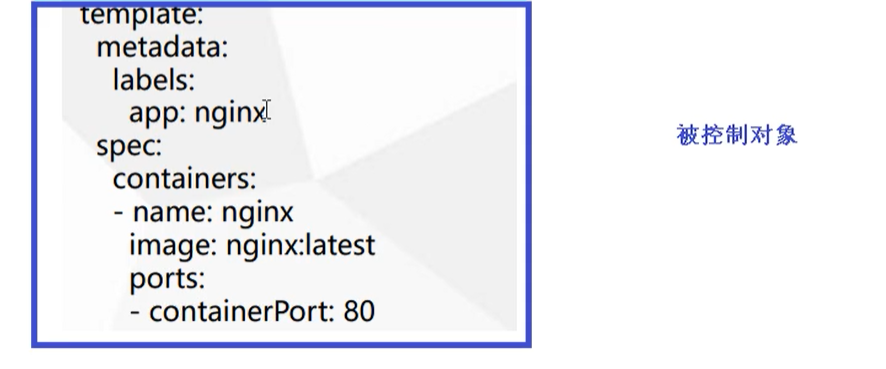
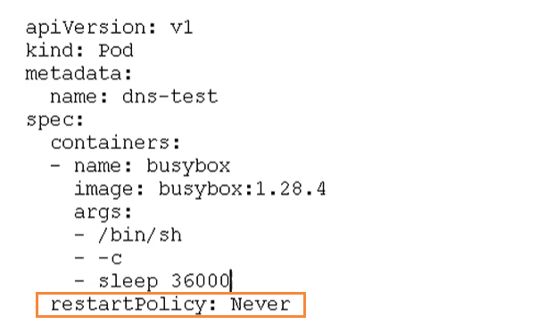
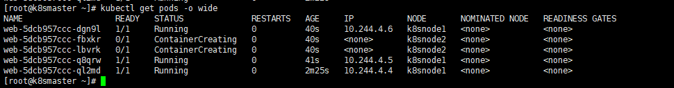

# 1. 安装和运行minikube

## 1.1 安装kubectl

### 1.1.1 直接安装

```bash
curl -LO https://storage.googleapis.com/kubernetes-release/release/$(curl -s https://storage.googleapis.com/kubernetes-release/release/stable.txt)/bin/linux/amd64/kubectl && chmod +x kubectl && sudo mv kubectl /usr/local/bin/
```

### 1.1.2 arch

```bash
yay -S kubectl
```

### 1.1.3 ubuntu

```bash
sudo apt-get update && sudo apt-get install -y apt-transport-https
curl -s https://packages.cloud.google.com/apt/doc/apt-key.gpg | sudo apt-key add -
echo "deb https://apt.kubernetes.io/ kubernetes-xenial main" | sudo tee -a /etc/apt/sources.list.d/kubernetes.list
sudo apt-get update
sudo apt-get install -y kubectl
```

### 1.1.4 centos

```bash
cat <<EOF> /etc/yum.repos.d/kubernetes.repo
[kubernetes]
name=Kubernetes
baseurl=https://mirrors.aliyun.com/kubernetes/yum/repos/kubernetes-el7-x86_64/
enabled=1
enabled=1
gpgcheck=0
EOF
yum install -y kubectl
```

### 1.1.5 macos

```bash
brew install kubernetes-cli
```

### 1.1.6 测试以确保您安装的版本是最新的：

```
kubectl version --client
```

## 1.2 安装minikube

### 1.2.1 直接安装

```bash
curl -LO https://storage.googleapis.com/minikube/releases/latest/minikube-linux-amd64 && sudo install minikube-linux-amd64 /usr/local/bin/minikube
# 根据对应系统安装 conntrack-tools
yum install -y conntrack-tools
```

### 1.2.2 arch

```bash
yay -S minikube
yay -S conntrack-tools
```


## 1.3 安装docker

### 1.3.1 ubuntu

```bash
# remove all previous Docker versions
sudo apt remove docker docker-engine docker.io

# Install packages to allow apt to use a repository over HTTPS
apt-get update && apt-get install apt-transport-https ca-certificates curl software-properties-common

# add Docker official GPG key
curl -fsSL https://download.docker.com/linux/ubuntu/gpg | sudo apt-key add -

# Add Docker repository (for Ubuntu Bionic) 注意：nvidia-docker会检查docker-ce版本，强制要求 ubuntu-bionic
# 所以这里必须采用 bionic 仓库安装 docker-ce
sudo add-apt-repository \
    "deb [arch=amd64] https://download.docker.com/linux/ubuntu \
    $(lsb_release -cs) \
    stable"

sudo apt update
sudo apt install docker-ce
systemctl daemon-reload
systemctl restart docker
```

### 1.3.2 centos

```bash
yum remove docker docker-client docker-client-latest docker-common docker-latest docker-latest-logrotate docker-logrotate docker-engine 
yum install -y yum-utils device-mapper-persistent-data lvm2  
yum-config-manager  --add-repo  http://mirrors.aliyun.com/docker-ce/linux/centos/docker-ce.repo
tee /etc/docker/daemon.json <<-'EOF'
{
	"registry-mirrors": 		  ["https://8sqb5nwq.mirror.aliyuncs.com"] 
}
EOF
systemctl daemon-reload 
systemctl restart docker
yum makecache fast
yum install -y docker-ce docker-ce-cli containerd.io
systemctl restart docker

```


- (可选) 将 `自己` 的账号添加到 `docker` 用户组:

  ```bash
  sudo adduser `id -un` docker
  ```

> 用户加入docker组还是需要重启主机操作系统才能直接使用 `docker ps`

## 1.4 运行

### 1.4.1 none

在主机上运行Kubernetes组件，而不是在 VM 中。使用该驱动依赖 Docker ([安装 Docker](https://docs.docker.com/install/linux/docker-ce/ubuntu/)) 和 Linux 环境

```bash
minikube start --vm-driver=none --image-repository=registry.cn-hangzhou.aliyuncs.com/google_containers
```


## 1.5 检查运行

```bash
minikube status

# 安装下bash-completion自动补全
```


# 2. 搭建k8s集群前置知识

## 2.1 搭建k8s环境平台规划

### 2.1.1 单master集群


### 2.1.2 多master集群


## 2.2 硬件要求

### 2.2.1 测试环境

| type   | cpu  | mem  | storage |
| ------ | ---- | ---- | ------- |
| master | 2核  | 4G   | 20G     |
| node   | 4核  | 8G   | 40G     |

2.2.2 生产环境

| type   | cpu  | mem  | storage |
| ------ | ---- | ---- | ------- |
| master | 8核  | 16G  | 100G    |
| node   | 16核 | 64G  | 200G    |

## 2.3 kubernetes集群搭建

### 2.3.1 介绍

#### 2.3.1.1 kubeadm

[官网地址](https://kubernetes.io/zh/docs/setup/production-environment/tools/kubeadm/install-kubeadm/)

kubeadm是一个K8S部署工具，提供kubeadm init 和 kubeadm join，用于快速部署Kubernetes集群

#### 2.3.1.2 二进制包方式

从github下载发行版的二进制包，手动部署每个组件，组成Kubernetes集群。

Kubeadm降低部署门槛，但屏蔽了很多细节，遇到问题很难排查。如果想更容易可控，推荐使用二进制包部署Kubernetes集群，虽然手动部署麻烦点，期间可以学习很多工作原理，也利于后期维护。

### 2.3.2 kubeadm部署集群

kubeadm 是官方社区推出的一个用于快速部署kubernetes 集群的工具，这个工具能通过两条指令完成一个kubernetes 集群的部署：

- 创建一个Master 节点kubeadm init
- 将Node 节点加入到当前集群中$ kubeadm join <Master 节点的IP 和端口>

#### 2.3.2.1 安装要求

在开始之前，部署Kubernetes集群机器需要满足以下几个条件

- 一台或多台机器，操作系统为Centos7.X
- 硬件配置：2GB或更多GAM，2个CPU或更多CPU，硬盘30G
- 集群中所有机器之间网络互通
- 可以访问外网，需要拉取镜像
- 禁止swap分区

#### 2.3.2.2 使用kuberadm方式搭建k8s集群

kubeadm是官方社区推出的一个用于快速部署kubernetes集群的工具。

这个工具能通过两条指令完成一个kubernetes集群的部署：

```bash
# 创建一个 Master 节点
kubeadm init

# 将一个 Node 节点加入到当前集群中
kubeadm join <Master节点的IP和端口 >
```

使用kubeadm方式搭建K8s集群主要分为以下几步

- 准备三台虚拟机，同时安装操作系统CentOS 7.x
- 对三个安装之后的操作系统进行初始化操作
- 在三个节点安装 docker kubelet kubeadm kubectl
- 在master节点执行kubeadm init命令初始化
- 在node节点上执行 kubeadm join命令，把node节点添加到当前集群
- 配置CNI网络插件，用于节点之间的连通【失败了可以多试几次】
- 通过拉取一个nginx进行测试，能否进行外网测试

#### 2.3.2.3 准备环境

| 角色   | IP              |
| ------ | --------------- |
| master | 192.168.194.170 |
| node1  | 192.168.194.171 |
| node2  | 192.168.194.172 |

然后开始在每台机器上执行下面的命令

```bash
# 关闭防火墙
systemctl stop firewalld
systemctl disable firewalld

# 关闭selinux
# 永久关闭
sed -i 's/enforcing/disabled/' /etc/selinux/config  
# 临时关闭
setenforce 0  

# 关闭swap
# 临时
swapoff -a 
# 永久关闭
sed -ri 's/.*swap.*/#&/' /etc/fstab

# 根据规划设置主机名【master节点上操作】
hostnamectl set-hostname k8smaster
# 根据规划设置主机名【node1节点操作】
hostnamectl set-hostname k8snode1
# 根据规划设置主机名【node2节点操作】
hostnamectl set-hostname k8snode2

# 在master添加hosts
cat >> /etc/hosts << EOF
192.168.194.170 k8smaster
192.168.194.171 k8snode1
192.168.194.172 k8snode2
EOF


# 将桥接的IPv4流量传递到iptables的链
cat > /etc/sysctl.d/k8s.conf << EOF
net.bridge.bridge-nf-call-ip6tables = 1
net.bridge.bridge-nf-call-iptables = 1
EOF
# 生效
sysctl --system  

# 时间同步
yum install ntpdate -y
ntpdate time.windows.com
```

#### 2.3.2.4 安装Docker/kubeadm/kubelet

所有节点安装Docker/kubeadm/kubelet ，Kubernetes默认CRI（容器运行时）为Docker，因此先安装Docker

##### 2.3.2.4.1 安装docker

```bash
yum remove docker docker-client docker-client-latest docker-common docker-latest docker-latest-logrotate docker-logrotate docker-engine
yum install -y yum-utils device-mapper-persistent-data lvm2  
yum-config-manager  --add-repo  http://mirrors.aliyun.com/docker-ce/linux/centos/docker-ce.repo
tee /etc/docker/daemon.json <<-'EOF'
{
	"registry-mirrors": 		  ["https://8sqb5nwq.mirror.aliyuncs.com"] 
}
EOF
systemctl daemon-reload 

yum makecache fast
yum install -y docker-ce docker-ce-cli containerd.io
systemctl enable --now docker
```

##### 2.3.2.4.2 所有集群安装kubeadm,kubelet和kubectl

```bash
cat > /etc/yum.repos.d/kubernetes.repo << EOF
[kubernetes]
name=Kubernetes
baseurl=https://mirrors.aliyun.com/kubernetes/yum/repos/kubernetes-el7-x86_64
enabled=1
gpgcheck=0
repo_gpgcheck=0
gpgkey=https://mirrors.aliyun.com/kubernetes/yum/doc/yum-key.gpg https://mirrors.aliyun.com/kubernetes/yum/doc/rpm-package-key.gpg
EOF

yum install -y kubelet-1.18.0 kubeadm-1.18.0 kubectl-1.18.0
systemctl enable --now kubelet
# 检查kubelet是否成功启动
```

#### 2.3.2.5 部署kubernetes Master节点

在master节点执行

```bash
kubeadm init --apiserver-advertise-address=192.168.194.170 --image-repository registry.aliyuncs.com/google_containers --kubernetes-version v1.18.0 --service-cidr=10.96.0.0/12  --pod-network-cidr=10.244.0.0/16
```

由于默认拉取镜像地址k8s.gcr.io国内无法访问，这里指定阿里云镜像仓库地址，【执行上述命令会比较慢，因为后台其实已经在拉取镜像了】，我们 docker images 命令即可查看已经拉取的镜像

等待kubernetes的镜像安装成功


使用kubectl工具 【master节点操作】

```bash
mkdir -p $HOME/.kube
sudo cp -i /etc/kubernetes/admin.conf $HOME/.kube/config
sudo chown $(id -u):$(id -g) $HOME/.kube/config
```

执行完成后，我们使用下面命令，查看我们正在运行的节点

```bash
kubectl get nodes
```

能够看到，目前有一个master节点已经运行了，但是还处于未准备状态

下面我们还需要在Node节点执行其它的命令，将node1和node2加入到我们的master节点上

#### 2.3.2.6 加入Kubernetes (Slave节点)

下面我们需要到 node1 和 node2服务器，执行下面的代码向集群添加新节点

执行在kubeadm init输出的kubeadm join命令：

> 注意，以下的命令是在master初始化完成后，每个人的都不一样！！！需要复制自己生成的

```bash
kubeadm join 192.168.194.170:6443 --token pn41hk.089se3j149uw38tv \
    --discovery-token-ca-cert-hash sha256:8060ea93b459b1d751805cf05661ef8f9c4e3fc6c23d482a1e277a530b903345
```

默认token有效期为24小时，当过期之后，该token就不可用了。这时就需要重新创建token，操作如下：

```
kubeadm token create --print-join-command
```

当我们把两个节点都加入进来后，我们就可以去Master节点 执行下面命令查看情况

```bash
kubectl get nodes
```


#### 2.3.2.7 部署CNI网络插件

上面的状态还是NotReady，下面我们需要网络插件，来进行联网访问

```bash
# 下载网络插件配置
wget https://raw.githubusercontent.com/coreos/flannel/master/Documentation/kube-flannel.yml
```

默认镜像地址无法访问，sed命令修改为docker hub镜像仓库。

```bash
# master添加
kubectl apply -f https://raw.githubusercontent.com/coreos/flannel/master/Documentation/kube-flannel.yml

##①首先下载v0.13.1-rc2-amd64 镜像
wget https://hub.fastgit.org/flannel-io/flannel/releases/download/v0.13.1-rc2/flanneld-v0.13.1-rc2-amd64.docker
##参考博客：https://www.cnblogs.com/pyxuexi/p/14288591.html
##② 导入镜像，命令，，特别提示，3个机器都需要导入，3个机器都需要导入，3个机器都需要导入，3个机器都需要导入，重要的事情说3遍。不然抱错。如果没有操作，报错后，需要删除节点，重置，在导入镜像，重新加入才行。本地就是这样操作成功的！
docker load < flanneld-v0.13.1-rc2-amd64.docker
#####下载本地，替换将image: quay.io/coreos/flannel:v0.13.1-rc2 替换为 image: quay.io/coreos/flannel:v0.13.1-rc2-amd64

# 查看状态 【kube-system是k8s中的最小单元】等待所有running
kubectl get pods -n kube-system
```

#### 2.3.2.8 测试kubernetes 集群

我们都知道K8S是容器化技术，它可以联网去下载镜像，用容器的方式进行启动

在Kubernetes集群中创建一个pod，验证是否正常运行

```bash
# 下载nginx 【会联网拉取nginx镜像】
kubectl create deployment nginx --image=daocloud.io/library/nginx
# 查看状态
kubectl get pods
```

如果我们出现Running状态的时候，表示已经成功运行了

下面我们就需要将端口暴露出去，让其它外界能够访问

```bash
# 暴露端口
kubectl expose deployment nginx --port=80 --type=NodePort
# 查看一下对外的端口
kubectl get pod,svc
```

能够看到，我们已经成功暴露了 80端口  到 32748上


ok,可以开始访问了

任意nodeip:prot

### 2.3.3 错误汇总

#### 2.3.3.1错误一

在执行Kubernetes  init方法的时候，出现这个问题

```bash
error execution phase preflight: [preflight] Some fatal errors occurred:
	[ERROR NumCPU]: the number of available CPUs 1 is less than the required 2
```

是因为VMware设置的核数为1，而K8S需要的最低核数应该是2，调整核数重启系统即可

#### 2.3.3.2 错误二

我们在给node1节点使用 kubernetes join命令的时候，出现以下错误

```bash
error execution phase preflight: [preflight] Some fatal errors occurred:
	[ERROR Swap]: running with swap on is not supported. Please disable swap
```

错误原因是我们需要关闭swap

```bash
# 关闭swap
# 临时
swapoff -a 
# 临时
sed -ri 's/.*swap.*/#&/' /etc/fstab
```

#### 2.3.3.3 错误三

在给node1节点使用 kubernetes join命令的时候，出现以下错误

```bash
The HTTP call equal to 'curl -sSL http://localhost:10248/healthz' failed with error: Get http://localhost:10248/healthz: dial tcp [::1]:10248: connect: connection refused
```

解决方法，首先需要到 master 节点，创建一个文件

```bash
# 创建文件夹
mkdir /etc/systemd/system/kubelet.service.d

# 创建文件
vim /etc/systemd/system/kubelet.service.d/10-kubeadm.conf

# 添加如下内容
Environment="KUBELET_SYSTEM_PODS_ARGS=--pod-manifest-path=/etc/kubernetes/manifests --allow-privileged=true --fail-swap-on=false"

# 重置
kubeadm reset
```

然后删除刚刚创建的配置目录

```bash
rm -rf $HOME/.kube
```

然后 在master重新初始化

```bash
kubeadm init --apiserver-advertise-address=202.193.57.11 --image-repository registry.aliyuncs.com/google_containers --kubernetes-version v1.18.0 --service-cidr=10.96.0.0/12  --pod-network-cidr=10.244.0.0/16
```

初始完成后，我们再到 node1节点，执行 kubeadm join命令，加入到master

```bash
kubeadm join 202.193.57.11:6443 --token c7a7ou.z00fzlb01d76r37s \
    --discovery-token-ca-cert-hash sha256:9c3f3cc3f726c6ff8bdff14e46b1a856e3b8a4cbbe30cab185f6c5ee453aeea5
```

添加完成后，我们使用下面命令，查看节点是否成功添加

```bash
kubectl get nodes
```

#### 2.3.3.4 错误四

我们再执行查看节点的时候，  kubectl get nodes 会出现问题

```bash
Unable to connect to the server: x509: certificate signed by unknown authority (possibly because of "crypto/rsa: verification error" while trying to verify candidate authority certificate "kubernetes")
```

这是因为我们之前创建的配置文件还存在，也就是这些配置

```bash
mkdir -p $HOME/.kube
sudo cp -i /etc/kubernetes/admin.conf $HOME/.kube/config
sudo chown $(id -u):$(id -g) $HOME/.kube/config
```

我们需要做的就是把配置文件删除，然后重新执行一下

```bash
rm -rf $HOME/.kube
```

然后再次创建一下即可

```bash
mkdir -p $HOME/.kube
sudo cp -i /etc/kubernetes/admin.conf $HOME/.kube/config
sudo chown $(id -u):$(id -g) $HOME/.kube/config
```

这个问题主要是因为我们在执行 kubeadm reset 的时候，没有把 $HOME/.kube 给移除掉，再次创建时就会出现问题了

#### 2.3.3.5 错误五

安装的时候，出现以下错误

```bash
Another app is currently holding the yum lock; waiting for it to exit...
```

是因为yum上锁占用，解决方法

```bash
yum -y install docker-ce
```

#### 2.3.3.6 错误六

在使用下面命令，添加node节点到集群上的时候

```bash
kubeadm join 192.168.177.130:6443 --token jkcz0t.3c40t0bqqz5g8wsb  --discovery-token-ca-cert-hash sha256:bc494eeab6b7bac64c0861da16084504626e5a95ba7ede7b9c2dc7571ca4c9e5
```

然后出现了这个错误

```bash
[root@k8smaster ~]# kubeadm join 192.168.177.130:6443 --token jkcz0t.3c40t0bqqz5g8wsb     --discovery-token-ca-cert-hash sha256:bc494eeab6b7bac64c0861da16084504626e5a95ba7ede7b9c2dc7571ca4c9e5
W1117 06:55:11.220907   11230 join.go:346] [preflight] WARNING: JoinControlPane.controlPlane settings will be ignored when control-plane flag is not set.
[preflight] Running pre-flight checks
	[WARNING IsDockerSystemdCheck]: detected "cgroupfs" as the Docker cgroup driver. The recommended driver is "systemd". Please follow the guide at https://kubernetes.io/docs/setup/cri/
error execution phase preflight: [preflight] Some fatal errors occurred:
	[ERROR FileContent--proc-sys-net-ipv4-ip_forward]: /proc/sys/net/ipv4/ip_forward contents are not set to 1
[preflight] If you know what you are doing, you can make a check non-fatal with `--ignore-preflight-errors=...`
To see the stack trace of this error execute with --v=5 or higher
```

出于安全考虑，Linux系统**默认是禁止数据包转发**的。所谓**转发即当主机拥有多于一块的网卡时，其中一块收到数据包，根据数据包的目的ip地址将包发往本机另一网卡，该网卡根据路由表继续发送数据包**。这通常就是路由器所要实现的功能。也就是说  **/proc/sys/net/ipv4/ip_forward** 文件的值不支持转发

- 0：禁止
- 1：转发

所以我们需要将值修改成1即可

```bash
echo “1” > /proc/sys/net/ipv4/ip_forward
```

修改完成后，重新执行命令即可


# 3. 集群管理工具 kubectl

kubectl是Kubernetes集群的命令行工具，通过kubectl能够对集群本身进行管理，并能够在集群上进行容器化应用的安装和部署

## 3.1 命令格式

```bash
kubectl [command] [type] [name] [flags]
```

参数

- command：指定要对资源执行的操作，例如create、get、describe、delete
- type：指定资源类型，资源类型是大小写敏感的，开发者能够以单数 、复数 和 缩略的形式

- name：指定资源的名称，名称也是大小写敏感的，如果省略名称，则会显示所有的资源

- flags：指定可选的参数，例如，可用 -s 或者 -server参数指定Kubernetes API server的地址和端口

## 3.2 常见命令

### 3.2.1 kubectl help 获取更多信息

通过 help命令，能够获取帮助信息

```bash
# 获取kubectl的命令
kubectl --help

# 获取某个命令的介绍和使用
kubectl get --help
```

### 3.2.2 基础命令

常见的基础命令

|  命令   |                      介绍                      |
| :-----: | :--------------------------------------------: |
| create  |          通过文件名或标准输入创建资源          |
| expose  |        将一个资源公开为一个新的Service         |
|   run   |           在集群中运行一个特定的镜像           |
|   set   |             在对象上设置特定的功能             |
|   get   |               显示一个或多个资源               |
| explain |                  文档参考资料                  |
|  edit   |          使用默认的编辑器编辑一个资源          |
| delete  | 通过文件名，标准输入，资源名称或标签来删除资源 |

### 3.2.3 部署命令

|      命令      |                        介绍                        |
| :------------: | :------------------------------------------------: |
|    rollout     |                   管理资源的发布                   |
| rolling-update |             对给定的复制控制器滚动更新             |
|     scale      | 扩容或缩容Pod数量，Deployment、ReplicaSet、RC或Job |
|   autoscale    |      创建一个自动选择扩容或缩容并设置Pod数量       |


### 3.2.4 集群管理命令

| 命令         | 介绍                           |
| ------------ | ------------------------------ |
| certificate  | 修改证书资源                   |
| cluster-info | 显示集群信息                   |
| top          | 显示资源(CPU/M)                |
| cordon       | 标记节点不可调度               |
| uncordon     | 标记节点可被调度               |
| drain        | 驱逐节点上的应用，准备下线维护 |
| taint        | 修改节点taint标记              |
|              |                                |

### 3.2.5 故障和调试命令

|     命令     |                             介绍                             |
| :----------: | :----------------------------------------------------------: |
|   describe   |                显示特定资源或资源组的详细信息                |
|     logs     | 在一个Pod中打印一个容器日志，如果Pod只有一个容器，容器名称是可选的 |
|    attach    |                     附加到一个运行的容器                     |
|     exec     |                        执行命令到容器                        |
| port-forward |                        转发一个或多个                        |
|    proxy     |             运行一个proxy到Kubernetes API Server             |
|      cp      |                    拷贝文件或目录到容器中                    |
|     auth     |                           检查授权                           |

### 3.2.6 其它命令

|     命令     |                        介绍                         |
| :----------: | :-------------------------------------------------: |
|    apply     |         通过文件名或标准输入对资源应用配置          |
|    patch     |            使用补丁修改、更新资源的字段             |
|   replace    |          通过文件名或标准输入替换一个资源           |
|   convert    |            不同的API版本之间转换配置文件            |
|    label     |                  更新资源上的标签                   |
|   annotate   |                  更新资源上的注释                   |
|  completion  |             用于实现kubectl工具自动补全             |
| api-versions |                 打印受支持的API版本                 |
|    config    | 修改kubeconfig文件（用于访问API，比如配置认证信息） |
|     help     |                    所有命令帮助                     |
|    plugin    |                 运行一个命令行插件                  |
|   version    |              打印客户端和服务版本信息               |

### 目前使用的命令

```bash
# 创建一个nginx镜像
kubectl create deployment nginx --image=nginx

# 对外暴露端口
kubectl expose deployment nginx --port=80 --type=NodePort

# 查看资源
kubectl get pod, svc
```


# 4. Kubernetes 集群YAML文件详解

## 4.1 概述

k8s 集群中对资源管理和资源对象编排部署都可以通过声明样式（YAML）文件来解决，也就是可以把需要对资源对象操作编辑到YAML 格式文件中，我们把这种文件叫做资源清单文件，通过kubectl 命令直接使用资源清单文件就可以实现对大量的资源对象进行编排部署了。一般在我们开发的时候，都是通过配置YAML文件来部署集群的。

YAML文件：就是资源清单文件，用于资源编排

## 4.2 YAML文件介绍

### 4.2.1 YAML概述

YAML ：仍是一种标记语言。为了强调这种语言以数据做为中心，而不是以标记语言为重点。

YAML 是一个可读性高，用来表达数据序列的格式。

### 4.2.2 YAML 基本语法

* 使用空格做为缩进
* 缩进的空格数目不重要，只要相同层级的元素左侧对齐即可
* 低版本缩进时不允许使用Tab 键，只允许使用空格
* 使用#标识注释，从这个字符一直到行尾，都会被解释器忽略
* 一般开始两个空格
* 字符后缩进一个空格，比如冒号，逗号等后面
* 使用 --- 表示新的yaml文件开始
* 

### 4.2.3 YAML 支持的数据结构

#### 4.2.3.1 对象

键值对的集合，又称为映射(mapping) / 哈希（hashes） / 字典（dictionary）

```yaml
# 对象类型：对象的一组键值对，使用冒号结构表示
name: Tom
age: 18

# yaml 也允许另一种写法，将所有键值对写成一个行内对象
hash: {name: Tom, age: 18}
```

#### 4.2.3.2 数组

```bash
# 数组类型：一组连词线开头的行，构成一个数组
People
- Tom
- Jack

# 数组也可以采用行内表示法
People: [Tom, Jack]
```

## 4.3 YAML文件组成部分

主要分为了两部分，一个是控制器的定义 和 被控制的对象

### 4.3.1 控制器的定义


### 4.3.2 被控制的对象

包含一些 镜像，版本、端口等



### 4.3.3 属性说明

在一个YAML文件的控制器定义中，有很多属性名称

|  属性名称  |    介绍    |
| :--------: | :--------: |
| apiVersion |  API版本   |
|    kind    |  资源类型  |
|  metadata  | 资源元数据 |
|    spec    |  资源规格  |
|  replicas  |  副本数量  |
|  selector  | 标签选择器 |
|  template  |  Pod模板   |
|  metadata  | Pod元数据  |
|    spec    |  Pod规格   |
| containers |  容器配置  |

## 4.4 如何快速编写YAML文件

一般来说，我们很少自己手写YAML文件，因为这里面涉及到了很多内容，我们一般都会借助工具来创建

### 4.4.1 使用kubectl create命令

这种方式一般用于资源没有部署的时候，我们可以直接创建一个YAML配置文件

```bash
# 尝试运行,并不会真正的创建镜像
kubectl create deployment web --image=nginx -o yaml --dry-run
```

或者我们可以输出到一个文件中

```bash
kubectl create deployment web --image=nginx -o yaml --dry-run > hello.yaml
```

然后我们就在文件中直接修改即可

### 4.4.2 使用kubectl get命令导出yaml文件

可以首先查看一个目前已经部署的镜像


然后导出 nginx001的配置

```bash
kubectl get deploy nginx001la -o=yaml --export > nginx001.yaml
```

然后会生成一个 `nginx.yaml` 的配置文件

# 5. Pod

## 5.1 Pod概述

Pod是K8S系统中可以创建和管理的最小单元，是资源对象模型中由用户创建或部署的最小资源对象模型，也是在K8S上运行容器化应用的资源对象，其它的资源对象都是用来支撑或者扩展Pod对象功能的，比如控制器对象是用来管控Pod对象的，Service或者Ingress资源对象是用来暴露Pod引用对象的，PersistentVolume资源对象是用来为Pod提供存储等等，K8S不会直接处理容器，而是Pod，Pod是由一个或多个container组成。

Pod是Kubernetes的最重要概念，每一个Pod都有一个特殊的被称为 “根容器”的Pause容器。Pause容器对应的镜像属于Kubernetes平台的一部分，除了Pause容器，每个Pod还包含一个或多个紧密相关的用户业务容器。

### 5.1.1 Pod基本概念

- 最小部署的单元
- Pod里面是由一个或多个容器组成【一组容器的集合】
- 一个pod中的容器是共享网络命名空间
- Pod是短暂的
- 每个Pod包含一个或多个紧密相关的用户业务容器

### 5.1.2 Pod存在的意义

- 创建容器使用docker，一个docker对应一个容器，一个容器运行一个应用进程
- Pod是多进程设计，运用多个应用程序，也就是一个Pod里面有多个容器，而一个容器里面运行一个应用程序


- Pod的存在是为了亲密性应用
  - 两个应用之间进行交互
  - 网络之间的调用【通过127.0.0.1 或 socket】
  - 两个应用之间需要频繁调用

Pod是在K8S集群中运行部署应用或服务的最小单元，它是可以支持多容器的。Pod的设计理念是支持多个容器在一个Pod中共享网络地址和文件系统，可以通过进程间通信和文件共享这种简单高效的方式组合完成服务。同时Pod对多容器的支持是K8S中最基础的设计理念。在生产环境中，通常是由不同的团队各自开发构建自己的容器镜像，在部署的时候组合成一个微服务对外提供服务。

Pod是K8S集群中所有业务类型的基础，可以把Pod看作运行在K8S集群上的小机器人，不同类型的业务就需要不同类型的小机器人去执行。目前K8S的业务主要可以分为以下几种

- 长期伺服型：long-running
- 批处理型：batch
- 节点后台支撑型：node-daemon
- 有状态应用型：stateful application

上述的几种类型，分别对应的小机器人控制器为：Deployment、Job、DaemonSet 和 StatefulSet  (后面将介绍控制器)

## 5.2 Pod实现机制

主要有以下两大机制

- 共享网络
- 共享存储

### 5.2.1 共享网络

容器本身之间相互隔离的，一般是通过 **namespace** 和 **group** 进行隔离，那么Pod里面的容器如何实现通信？

- 首先需要满足前提条件，也就是容器都在同一个**namespace**之间

关于Pod实现原理，首先会在Pod会创建一个根容器： `pause容器`，然后我们在创建业务容器 【nginx，redis 等】，在我们创建业务容器的时候，会把它添加到 `info容器` 中

而在 `info容器` 中会独立出  ip地址，mac地址，port 等信息，然后实现网络的共享


完整步骤如下

- 通过 Pause 容器，把其它业务容器加入到Pause容器里，让所有业务容器在同一个名称空间中，可以实现网络共享

### 5.2.2 共享存储

Pod持久化数据，专门存储到某个地方中


使用 Volumn数据卷进行共享存储，案例如下所示

## 5.3 Pod镜像拉取策略

我们以具体实例来说，拉取策略就是 `imagePullPolicy`


拉取策略主要分为了以下几种

- IfNotPresent：默认值，镜像在宿主机上不存在才拉取
- Always：每次创建Pod都会重新拉取一次镜像
- Never：Pod永远不会主动拉取这个镜像

## 5.4 Pod资源限制

也就是我们Pod在进行调度的时候，可以对调度的资源进行限制，例如我们限制 Pod调度是使用的资源是 2C4G，那么在调度对应的node节点时，只会占用对应的资源，对于不满足资源的节点，将不会进行调度


### 5.4.1 示例

我们在下面的地方进行资源的限制


这里分了两个部分

- request：表示调度所需的资源
- limits：表示最大所占用的资源

## 5.5 Pod重启机制

因为Pod中包含了很多个容器，假设某个容器出现问题了，那么就会触发Pod重启机制



重启策略主要分为以下三种

- Always：当容器终止退出后，总是重启容器，默认策略 【nginx等，需要不断提供服务】
- OnFailure：当容器异常退出（退出状态码非0）时，才重启容器。
- Never：当容器终止退出，从不重启容器 【批量任务】

## 5.6 Pod健康检查

通过容器检查，原来我们使用下面的命令来检查

```bash
kubectl get pod
```

但是有的时候，程序可能出现了 **Java** 堆内存溢出，程序还在运行，但是不能对外提供服务了，这个时候就不能通过 容器检查来判断服务是否可用了

这个时候就可以使用应用层面的检查

```bash
# 存活检查，如果检查失败，将杀死容器，根据Pod的restartPolicy【重启策略】来操作
livenessProbe

# 就绪检查，如果检查失败，Kubernetes会把Pod从Service endpoints中剔除
readinessProbe
```


Probe支持以下三种检查方式

- http Get：发送HTTP请求，返回200 - 400 范围状态码为成功
- exec：执行Shell命令返回状态码是0为成功
- tcpSocket：发起TCP Socket建立成功

## 5.7 Pod调度策略

### 5.7.1 创建Pod流程

- 首先创建一个pod，然后创建一个API Server 和 Etcd【把创建出来的信息存储在etcd中】
- 然后创建 Scheduler，监控API Server是否有新的Pod，如果有的话，会通过调度算法，把pod调度某个node上
- 在node节点，会通过 `kubelet -- apiserver ` 读取etcd 拿到分配在当前node节点上的pod，然后通过docker创建容器


### 5.7.2 影响Pod调度的属性

Pod资源限制对Pod的调度会有影响

#### 5.7.2.1 根据request找到足够node节点进行调度


关于节点选择器，其实就是有两个环境，然后环境之间所用的资源配置不同


我们可以通过以下命令，给我们的节点新增标签，然后节点选择器就会进行调度了

```bash
kubectl label node node1 env_role=prod
```


#### 5.7.2.2 节点亲和性

节点亲和性 **nodeAffinity** 和 之前nodeSelector 基本一样的，根据节点上标签约束来决定Pod调度到哪些节点上

- 硬亲和性：约束条件必须满足
- 软亲和性：尝试满足，不保证


支持常用操作符：in、NotIn、Exists、Gt、Lt、DoesNotExists

反亲和性：就是和亲和性刚刚相反，如 NotIn、DoesNotExists等


## 5.8 污点和污点容忍

### 5.8.1 概述

nodeSelector 和 NodeAffinity，都是Prod调度到某些节点上，属于Pod的属性，是在调度的时候实现的。

Taint 污点：节点不做普通分配调度，是节点属性

### 5.8.2 场景

- 专用节点【限制ip】
- 配置特定硬件的节点【固态硬盘】
- 基于Taint驱逐【在node1不放，在node2放】

### 5.8.3 查看污点情况

```bash
kubectl describe node k8smaster | grep Taint
```


污点值有三个

- NoSchedule：一定不被调度
- PreferNoSchedule：尽量不被调度【也有被调度的几率】
- NoExecute：不会调度，并且还会驱逐Node已有Pod

### 5.8.4 未节点添加污点

```bash
kubectl taint node [node] key=value:污点的三个值
```

举例：

```bash
kubectl taint node k8snode1 env_role=yes:NoSchedule
```

### 5.8.5 删除污点

```bash
kubectl taint node k8snode1 env_role:NoSchedule-
```


### 5.8.4 演示

我们现在创建多个Pod，查看最后分配到Node上的情况

首先我们创建一个 nginx 的pod

```bash
kubectl create deployment web --image=nginx
```

然后使用命令查看

```bash
kubectl get pods -o wide
```


我们可以非常明显的看到，这个Pod已经被分配到 k8snode1 节点上了

下面我们把pod复制5份，在查看情况pod情况

```bash
kubectl scale deployment web --replicas=5
```

我们可以发现，因为master节点存在污点的情况，所以节点都被分配到了 node1 和 node2节点上



我们可以使用下面命令，把刚刚我们创建的pod都删除

```bash
kubectl delete deployment web
```

现在给了更好的演示污点的用法，我们现在给 node1节点打上污点

```bash
kubectl taint node k8snode1 env_role=yes:NoSchedule
```

然后我们查看污点是否成功添加

```bash
kubectl describe node k8snode1 | grep Taint
```


然后我们在创建一个 pod

```bash
# 创建nginx pod
kubectl create deployment web --image=nginx
# 复制五次
kubectl scale deployment web --replicas=5
```

然后我们在进行查看

```bash
kubectl get pods -o wide
```

我们能够看到现在所有的pod都被分配到了 k8snode2上，因为刚刚我们给node1节点设置了污点


最后我们可以删除刚刚添加的污点

```bash
kubectl taint node k8snode1 env_role:NoSchedule-
```

### 5.8.5 污点容忍

污点容忍就是某个节点可能被调度，也可能不被调度


